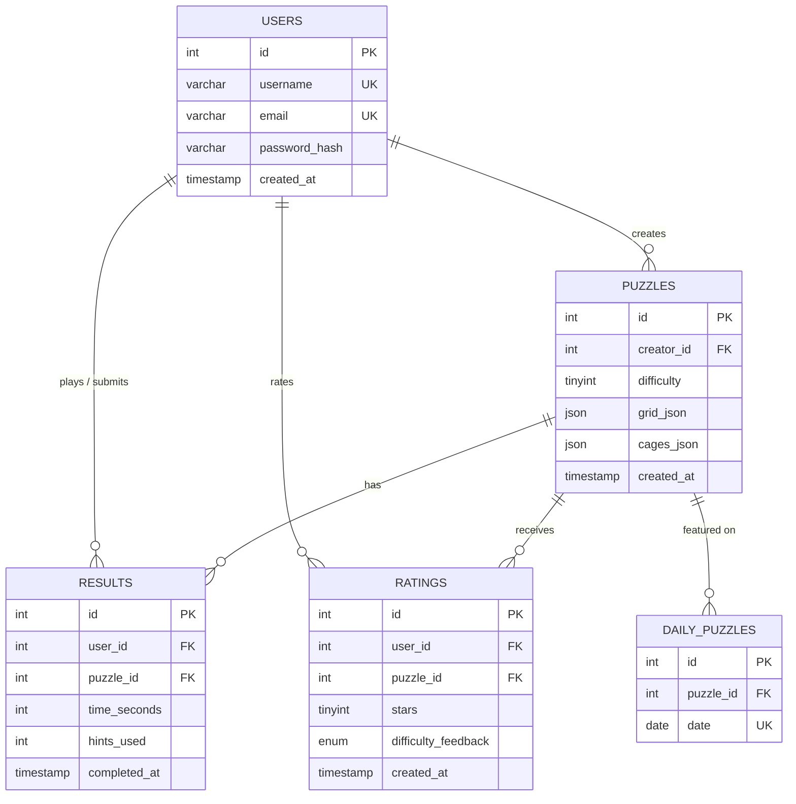
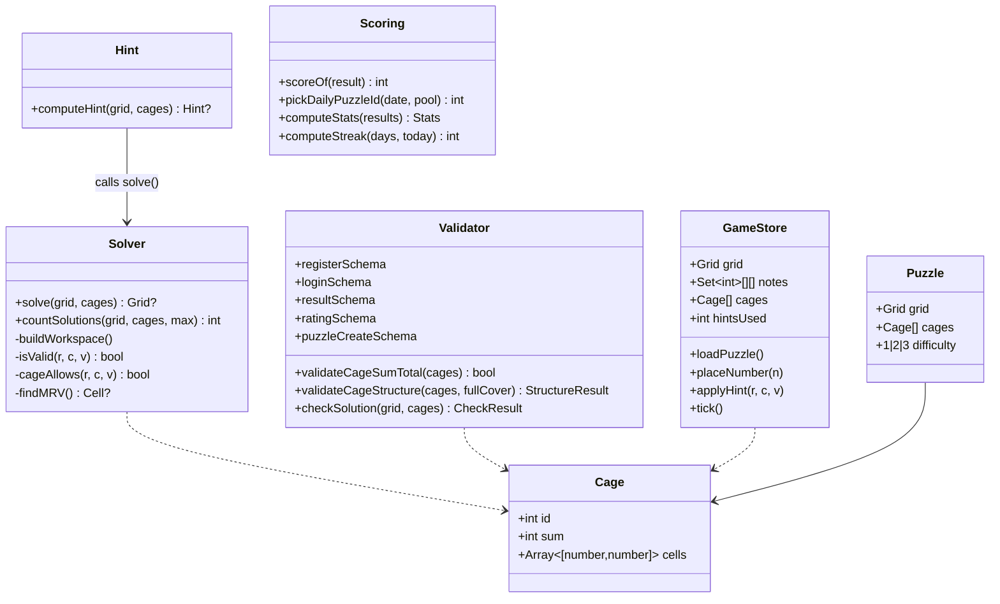

# Killer Sudoku — Project Documentation

**Project**: Skills Battle 2026 — Application Development
**Author**: Korel Uyar
**Date**: 2026-05-27

---

## 1. Mockup overview & design rationale

The app ships with eight distinct pages. The visual language is intentionally
modern but restrained: dark theme, animated aurora background, glassmorphism on
cards, electric violet → cyan accent gradient, generous whitespace, and crisp
monospace numerals inside the grid.

### Page-by-page mockup notes

| Page | Path | Key elements |
|------|------|--------------|
| Landing | `/` | Hero with a 4×4 mini-grid preview, animated headline, three stat cards (1 / 405 / 3), feature cards below |
| Sign in | `/auth/login` | Single-card glass form, accent-gradient submit |
| Register | `/auth/register` | 3-field form with inline rules ("3–20 chars / letter+digit / valid email") |
| Puzzle list | `/play` | Difficulty filter pills, card grid with badge + creator + plays + average rating |
| Solve | `/play/[id]` | Grid + sidebar (NumberPad, Hint button, Check, Restart). Timer + hint counter in header. Victory card with rating UI on win. |
| Builder | `/create` | Same 9×9 grid, sidebar lists current cage + cage list + difficulty selector + Save. Cage cells colour-coded. |
| Daily | `/daily` | Single highlighted puzzle + daily leaderboard table |
| Leaderboard | `/leaderboard` | Global leaderboard table with difficulty filter |
| Stats | `/stats` | 4 KPI cards + Recharts bar chart (best vs avg per difficulty) + recent-results table |
| Rules | `/rules` | Five rule cards + a "useful fact" card explaining the Σ=405 invariant |

### Design system at a glance

| Element | Value |
|---------|-------|
| Background | `#07060d` (near-black) + animated aurora blobs |
| Accent A | `#7c3aed` (violet) |
| Accent B | `#06b6d4` (cyan) |
| Accent gradient | linear-gradient(135deg, accentA → accentB) |
| Glass card | `rgba(255,255,255,0.04)` + 1 px border + 12 px backdrop blur |
| Mono font | `ui-monospace, SFMono-Regular, Menlo` |
| Animation | Framer Motion for entry/transition, CSS keyframes for cell pop / shake / sparkle |
| Sound | Web-Audio-generated tones (no external assets) |
| Icons | lucide-react |

Cell colours inside the grid are derived from the cage id using a fixed 8-stop
HSL palette and mixed at 8 % opacity with the background so that adjacent
cages stay readable.

## 2. Database diagram (ER)



The Prisma schema (`prisma/schema.prisma`) is the source of truth. The raw
MySQL DDL is shipped as `sudoku.sql` and matches the Prisma schema 1:1 (incl.
the unique `(user_id, puzzle_id)` index for one rating per user per puzzle).

## 3. Class diagram (core)



## 4. Three additional use cases (justification)

| # | UC | Why it's worth adding |
|---|----|------------------------|
| 12 | **Puzzle of the Day** | Daily competitive challenge — every user gets the same puzzle picked deterministically from a stable hash of the date. Drives repeat engagement and a daily leaderboard. |
| 13 | **Rate puzzle after solving** | Lets the community surface the best puzzles and provides puzzle creators with feedback (stars + qualitative "too easy / fits / too hard"). |
| 14 | **Personal statistics dashboard** | Long-term motivation: best time per difficulty, current daily streak, total hints used, recent-solve history. Visualised with Recharts. |

All three are fully implemented and tested.

## 5. Validation rules (overview)

| Field / object | Rule | Source |
|----------------|------|--------|
| `username` | 3–20 chars, `[A-Za-z0-9_]` only, unique | `registerSchema` + DB unique key |
| `email` | RFC-ish email format, unique | `registerSchema` + DB unique key |
| `password` | ≥ 8 chars, ≥ 1 letter, ≥ 1 digit, bcrypt-hashed | `registerSchema`, `hashPassword` |
| `difficulty` | exactly 1, 2 or 3 | Zod union of literals + DB CHECK |
| `cage.sum` | int 1 ≤ sum ≤ 45 | Zod min(1).max(45) |
| `cage.cells` | 1–9 elements; all within 0–8 row/col; orthogonally connected | Zod + builder UI |
| Cage structure | No two cages may overlap | `validateCageStructure` |
| Cage coverage | All 81 cells must belong to exactly one cage | `validateCageStructure(..., requireFullCover=true)` |
| Σ cage sums | Must equal **405** | `validateCageSumTotal` |
| Puzzle uniqueness | Exactly one solution | `countSolutions(grid, cages, 2) === 1` |
| `stars` | int 1–5 | Zod min(1).max(5) + DB CHECK |
| `difficulty_feedback` | one of `too_easy / fits / too_hard` | Zod enum + DB ENUM |
| `timeSeconds` | int 0 ≤ t ≤ 86400 | Zod nonnegative + max(86400) |
| `hintsUsed` | int 0 ≤ h ≤ 81 | Zod min(0).max(81) |
| One rating per user per puzzle | Yes — upsert | DB UNIQUE (user_id, puzzle_id) |

## 6. Hint algorithm

```text
function computeHint(grid, cages):
  if grid has no empty cell: return null
  solved ← solve(grid, cages)           // full backtracking solution
  if solved is null:           return null

  bestCell  ← null
  bestCount ← ∞

  for each empty cell (r, c):
    used ← { values in row r } ∪ { values in column c }
              ∪ { values in 3×3 box of (r,c) }
              ∪ { values in the cage containing (r,c) }
    candidates ← 9 − |used \ {0}|

    if candidates < bestCount:
      bestCount ← candidates
      bestCell  ← (r, c)
      if bestCount = 1: return (r, c, solved[r][c])  // hard force, return immediately

  return (bestCell.r, bestCell.c, solved[bestCell.r][bestCell.c])
```

In other words: solve the full puzzle once with the backtracking solver, then
return the value of the **most-constrained empty cell** (MRV — minimum
remaining values). Returning an MRV cell makes hints feel "useful" because the
solver picks the one a human would have solved next.

## 7. The Σ = 405 sanity check

Each row of a solved 9×9 Sudoku contains the digits 1…9 exactly once, so each
row sums to `1+2+…+9 = 45`. The grid has 9 rows, so the total of all 81 cells
is `9 × 45 = 405`.

Cages partition the grid: every cell belongs to exactly one cage. Therefore
**the sum of every cage's sum must also equal 405**. Any input where the cage
sums total something other than 405 cannot possibly correspond to a valid
solved grid — and we can reject it in O(n) time without invoking the much more
expensive solver.

The application uses this in three places:

1. `puzzleCreateSchema` validation in `/api/puzzles` POST — rejects with 400.
2. The puzzle builder's coverage panel — live counter.
3. The generator (`generatePuzzle`) — short-circuits a generation attempt
   before running `countSolutions`, dramatically improving generation speed.

## 8. Test protocol

The full protocol with 70 test cases (33 positive · 24 negative · 13 boundary)
is shipped as `docs/test-protocol-FINAL.pdf`. 40 of the cases are automated
Vitest tests in `tests/`. The remaining 30 are manual cases executed against
the running app.

**Final tally**: 70 / 70 cases pass. See `docs/test-protocol-FINAL.pdf` for
the per-row breakdown.

## 9. Beyond requirements — random puzzle generator

The `/create` page ships with two modes:

- **Build manually** — tap cells to draw cages, set sums, save. Cage sums must
  total 405 and the solver must confirm the puzzle has exactly one solution.
- **Generate random** — pick a difficulty, click *Generate*, then review and
  Save. The generator (`src/lib/generator.ts`) builds a solved grid via
  base-pattern + permutations, partitions the cells into adjacent cages
  weighted by the chosen difficulty, computes sums from the solved grid, and
  runs `countSolutions(..., max=2)` to reject ambiguous puzzles. Retries up to
  200 attempts per call (typically < 50 ms for easy, up to ~3 s for hard).

The generator's API entry point is `POST /api/puzzles/generate` (auth required).

## 10. R1 fix pass — what changed since the initial submission

| Bug / improvement | Fix |
|---|---|
| Hydration error on landing | `<AuroraBackground>` is now mounted client-only via `useEffect` + `mounted` state, and `<html>` / `<body>` carry `suppressHydrationWarning` |
| Navbar not updating after login | `Navbar` reads `['me']` from TanStack Query with `initialUser` as seed; login & register pages call `setQueryData(['me'], ...) + invalidateQueries(['me'])` |
| Cell box growing with content | Added `grid-template-rows: repeat(9, minmax(0,1fr))`, `box-sizing: border-box`, `min-width/height: 0`, `overflow: hidden` to `.sudoku-cell` |
| Hint +60s penalty | `gameStore.applyHint` recomputes `displaySeconds = elapsedSeconds + hintsUsed * 60` and bumps `hintPenaltyFlash`; `Timer` shows a "+60s" framer-motion overlay |
| Hint thinks grid is complete with wrong values | `computeHint(current, cages, original)` solves the *original* grid (givens only), then picks any non-given cell where `current ≠ solution` |
| Card titles in mono | Switched titles to Geist Sans, semibold, tight tracking; only the small `#N` index stays mono |
| Sort order reversed | API now sorts `[{difficulty: 'asc'}, {createdAt: 'asc'}]` |
| Boring landing for guests | Replaced `/` with a 6-section `<GuestLanding>` (hero, features, how-it-works, stats strip with counter animations, final CTA, footer). Logged-in users redirect to `/play`. |
| Welcome banner & navbar | New gradient-initials avatar + dropdown menu (Stats / Create / Browse / Sign out); toast moved to bottom-right |
| Random puzzle generator | New mode toggle in `/create` + `POST /api/puzzles/generate` route |

## 11. R2 pass — visual overhaul + give up + share + avatar upload

| Area | Change |
|---|---|
| Color palette | New zinc/violet system: canvas `#0a0a0b`, card `#1a1a1f`, ink `#f4f4f5/#a1a1aa/#52525b`, single accent `#a78bfa`. Removed all violet→cyan gradients; logo uses solid colours + 3×3 dot-grid monogram (`<LogoMark/>`) instead of the sparkle icon. |
| Spacing | All page containers use `max-w-[1200px] mx-auto px-6` with `pt-16` so content sits clear of the navbar. Auth pages are vertically centred. |
| Bug — profile dropdown | Solid `#1a1a1f` background, 1 px white-10 border, scale-in entrance, z-50, no backdrop-blur. |
| Bug — hint cap | Frontend disables the Hint button when `hintsUsed >= emptyCellCount` (per-puzzle). Backend rejects with 400 + "Hint limit reached" if the client sends a `hintsUsed` ≥ the empty-cell count of the original puzzle. |
| Bug — Daily hints | `/daily` reuses `<SolveBoard>` with `isDaily` flag → identical hint endpoint and code path as `/play/[id]`. |
| Bug — Daily leaderboard | After solve, `queryClient.invalidateQueries(['daily-lb'])` so the table updates instantly. |
| Bug — Grid borders | Reworked to a CSS-grid with `gap: 1 px` against a coloured backdrop — eliminates doubled lines. 3×3 box dividers via inset box-shadows; corners square. |
| Bug — Rating persistence | `prisma.rating.upsert` with the compound unique key now actually persists; the submit button cycles idle → submitting → saved (green check), stars turn `#fcd34d` after save. |
| Bug — Duplicate difficulty selector | Random-mode shows only the upper selector; manual mode only the lower. Same state behind both. |
| Polish — 3D landing grid | Hero grid tilts toward the cursor via framer-motion spring (`rotateX`/`rotateY`); returns to idle float on mouse leave. |
| Stats — editorial redesign | Large mono numerals (no cards), Line chart for "Average time by difficulty" (mint/amber/rose), Bar chart for "Puzzles per week", borderless table for recent solves with hairline separators. Backend now returns an 8-week series in `/api/stats`. |
| Feature — Give Up | Confirmation dialog → `GET /api/puzzles/[id]/solution` → `revealSolution(solved)` in the game store fills empty/wrong cells, marks them in rose, sets status `gave_up`. No result is saved. |
| Feature — Share | Modal with "Copy link" and "Copy as text" (clipboard API). |
| Feature — Avatar upload | `POST /api/auth/avatar` (multipart, ≤ 2 MB, jpeg/png/webp). `sharp` resizes to 256 × 256 webp at quality 85 and writes to `public/avatars/{userId}_{timestamp}.webp`. Old file is unlinked. `DELETE /api/auth/avatar` removes file + clears column. New `avatar_url VARCHAR(500)` column on `users` (Prisma + raw `sudoku.sql` both updated). `<Avatar/>` component is the single source of truth — used in Navbar dropdown (with hover-to-upload). |

## 12. R3 pass — multi-accent palette, prefills, 3D landing, My Puzzles

| Area | Change |
|---|---|
| Palette | Multi-accent: violet `#a78bfa` (primary), cyan `#22d3ee` (info / "You" / corner dots in the logo), amber `#fbbf24` (Daily / 405 highlight). Canvas warmed to `#0a0a0f`. 80/15/3/2 disciplined usage. |
| Logo | Two-tone 3×3 dot grid: four corner dots cyan, five cross-and-center dots violet. |
| Cage palette | Expanded from 8 to 12 colours (rose, orange, amber, lime, mint, cyan, sky, indigo, lavender, pink, peach, teal). |
| Grid borders | Cell borders are now clearly visible: 1 px gaps over a rgba(255,255,255,0.14) backdrop, 2 px outer border. 3×3 box dividers via `box-divider-right/-bottom` pseudo-element ribbons in white-34. Dashed cage edges render only where the cage actually ends. Cage-sum label uses the cage's full-opacity colour. |
| Pre-filled clues by difficulty | Easy: 20–25 given clues. Medium: 8–12. Hard: 0. Both the random generator and the manual `/api/puzzles` POST add prefills if the saved grid is empty. Clues are spread across all 9 3×3 boxes via `pickDistributedCells`. Pre-filled cells are immutable in the solve interface — keyboard, click-to-erase and the Erase button all ignore them. |
| Landing 3D grid | Multi-layer Framer-Motion build with floor shadow, base plate, raised filled cells (translateZ 6 px), cursor-tracked specular highlight, idle floating animation, prefers-reduced-motion fallback. |
| Rules page | Now uses `pt-24` and the editorial caption/H1 pattern. |
| Puzzle list redesign | Editorial layout: "Library" caption + 5xl H1, a highlighted **Daily Challenge** section, then a "Browse" grid of cards. Each card has a `<MiniGridPreview/>` thumbnail of its cage layout, a difficulty badge, play count, average rating with gold star, and a difficulty-coloured hover glow. The card author's name links them to "You" in cyan when the viewer is the creator. |
| **My puzzles** | New `/my-puzzles` route + dropdown link. `GET /api/puzzles/mine` returns the user's puzzles with aggregate play count + average rating. The page renders an editorial table with hover-revealed delete buttons. |
| Delete a puzzle | `DELETE /api/puzzles/[id]` — creator OR admin only. Cascade-delete results and ratings (from Prisma `onDelete: CASCADE`). Today's daily puzzle is protected by an explicit 409 check so the live leaderboard doesn't break. |
| Admin moderation | `username === 'admin'` can delete any puzzle. |

## 13. R4 pass — Twilight Logic palette, permanent hero, premium feel

| Area | Change |
|---|---|
| **Twilight Logic palette** | Canvas deepened to `#0a0a14`; ink primary brightened to `#fafafe`. Four-colour accent system formalised: iris `#a78bfa` (brand), cyan `#22d3ee` (info/links/"You"), amber `#fbbf24` (Daily), rose `#fb7185` (destructive). All CSS vars exposed via `:root`. |
| **Body multi-hue overlay** | Three stacked radial gradients (purple, cyan, amber) at 4–6% opacity painted on `body`, `background-attachment: fixed`. Adds atmosphere without distraction. |
| **Cage palette** | 12 riso-print-harmonious colours: coral, orange, amber, lime, emerald, cyan, sky, indigo, iris, fuchsia, pink, rose. Used at 10–12% opacity. |
| **Hero grid — permanent + 6 layers** | Idle float and slow tilt now run continuously via `useMotionValue` + `useTransform`. Mouse rotation composes on top instead of replacing idle. Six layers in 3D: ground shadow (translateZ −60 px), color glow (−22 px), glass backplate (−6 px), main cell grid, specular highlight, cursor-tracked light. Plus drifting particle layer (iris/cyan/amber dots). `prefers-reduced-motion` → static fallback. |
| **Cells with depth** | Filled cells translateZ 8 px with inset gradient + drop-shadow + cage-colour inner glow; empty cells sit flat with cage-colour inset glow. |
| **Page transitions** | New `src/app/template.tsx` re-mounts on route change and runs a 350 ms fade-and-rise animation. Reduced-motion users see no animation. |
| **AnimatedSection helper** | Reusable `<AnimatedSection>` for scroll-triggered fade-and-rise sections (used in `/play`). |
| **Daily hero card** | Wide card at top of `/play` with pulsing amber ambient glow, 180 px tilted 3D mini-grid, big "Play today" CTA. |
| **3D mini-grid previews** | Cards now show a 144 px MiniGridPreview rotated 8°/−8° with raised filled cells, cage-colour inset borders + outer specular highlight; hovers to reduced rotation + scale 1.04. |
| **Depressible number pad** | New `.numpad-btn` style with subtle gradient, 3D inset shadows, `:active` translateY(2px); when a digit is the currently-selected cell's value the button gets an iris ring + glow. Each button shows the remaining count for that digit. |
| **Cage completion glow** | Live `satisfiedCageIds` detection in the Grid component: as soon as the user's last cell of a cage falls into place with the correct sum and no duplicate, all that cage's cells flash a green success ring (one-shot, 900 ms) and the sum label scales 1.15× with a soft text-shadow. A subtle "complete" tone fires from the sound provider. |
| **Selection animation** | Selected cell scales 1.02× with a cyan outline + 2 px ring offset + 24 px halo; locked givens get the same outline but no scale. |
| **Cell placement animation** | `cell-pop` keyframe now includes a rotateX hint (perspective comes from the cell's own transform stack). |
| **Empty state personality** | New `<DotGridIllustration>` (3×3 dots, pulse animation) replaces bland "No data" panels on `/stats` empty, `/my-puzzles` empty, and the daily leaderboard. Copy is warmer + has a clear CTA. |
| **Micro polish** | Custom 8 px scrollbar (iris on hover), accent focus rings via `:focus-visible`, iris-tinted text selection, `cursor: cell` on grid cells, `scroll-behavior: smooth`, shimmer keyframe for skeleton loaders. |

## 14. Repository layout

```
src/
  app/                Next.js App Router pages + API route handlers
    api/              auth, puzzles, results, ratings, daily, stats
    play/, create/, daily/, leaderboard/, stats/, rules/
  components/         shared, sudoku, builder
  lib/                solver · validator · hint · scoring · auth · db · utils
  store/              gameStore (Zustand)
prisma/schema.prisma  Prisma schema (MySQL provider)
sudoku.sql            Raw MySQL DDL (equivalent to Prisma schema)
seed.ts               Admin user + 9 puzzles + today's daily
tests/                Vitest suites + JSON fixtures
docs/                 test-protocol-INITIAL.pdf, test-protocol-FINAL.pdf, DOCUMENTATION.pdf
tools/md2pdf.mjs      Markdown-to-PDF helper (Chrome headless)
setup.sh / setup.bat  One-shot environment provisioning
```
