<div class="cover">

# Killer Sudoku

### Application Development · Skills Battle 2026

**Korel Uyar** · BZZ Bildungszentrum Zürichsee · IA24a

Mai 2026 · Version 1.0 (Final Submission)

GitHub: <https://github.com/KorelUyar/killer-sudoku>
Live: *deployment pending — Setup-Anleitung in §15*

</div>

<div class="toc">

## Inhaltsverzeichnis

1. [Projektübersicht](#1-projektübersicht)
2. [Tech-Stack](#2-tech-stack)
3. [Mockups](#3-mockups)
4. [Design-Rationale](#4-design-rationale)
5. [Datenbank-Diagramm](#5-datenbank-diagramm)
6. [Klassen-Diagramm](#6-klassen-diagramm)
7. [Use Cases — Übersicht](#7-use-cases--übersicht)
8. [Zusätzliche Use Cases — Begründung](#8-zusätzliche-use-cases--begründung)
9. [Validierungs-Regeln](#9-validierungs-regeln)
10. [Σ = 405 Theorem](#10-σ--405-theorem)
11. [Hint-Algorithmus](#11-hint-algorithmus)
12. [Puzzle-Generator](#12-puzzle-generator)
13. [Architektur-Übersicht](#13-architektur-übersicht)
14. [Test-Protokoll](#14-test-protokoll)
15. [Setup-Anleitung](#15-setup-anleitung)
16. [Live-Demo](#16-live-demo)
17. [GitHub Repository](#17-github-repository)
18. [Limitationen & Bekannte Issues](#18-limitationen--bekannte-issues)
19. [Anhang](#19-anhang)

</div>

## 1. Projektübersicht

**Killer Sudoku** ist eine Variante des klassischen 9×9-Sudoku, bei der zusätzlich zu den Standard-Regeln (jede Ziffer 1–9 genau einmal pro Zeile, Spalte und 3×3-Block) sogenannte **Cages** (gestrichelt umrandete Bereiche) eingeführt werden. Jeder Cage hat eine vorgegebene Summe; die Ziffern innerhalb eines Cage müssen genau diese Summe ergeben und dürfen sich nicht wiederholen.

Diese Web-Applikation wurde für die *Skills Battle 2026 — Application Development* entwickelt. Die Aufgabenstellung verlangte eine vollwertige Spiel-Plattform, die die elf Pflicht-Use-Cases (Regeln lesen, Account anlegen, Login, Puzzle eingeben & speichern, Puzzle lösen, Hint anfordern, Bestenliste, Lösung prüfen, Resultat speichern, Auto-Solve) sowie drei selbst gewählte zusätzliche Use Cases implementiert.

Die fertige Anwendung deckt **alle 14 Use Cases** vollständig ab. Sie verwendet **Next.js 15** mit dem App Router als Full-Stack-Framework und persistiert Daten in **MySQL 8** über das **Prisma ORM**. Sämtliche Spiel-Logik (Solver mit Backtracking + MRV-Heuristik, Eindeutigkeits-Prüfung, Hint-System mit Minimum-Remaining-Values, Generator mit difficulty-abhängiger Prefill-Anzahl) ist in **TypeScript strict** geschrieben und durch **63 automatisierte Vitest-Unit-Tests** abgesichert.

Über das reine Pflichtprogramm hinaus erhielt die App ein durchdachtes Design-System („Twilight Logic"): vier-Farben-Akzent (Iris/Cyan/Amber/Rose), animierter Multi-Layer-3D-Hero, depressible Number-Pad-Buttons, cage-Completion-Feedback und ein Editorial-Style-Stats-Dashboard. Inspiration: Linear, Vercel, Arc Browser, Stripe Press.

## 2. Tech-Stack

| Komponente | Technologie | Begründung |
|---|---|---|
| Framework | Next.js 15 (App Router) | Full-Stack React mit Server Components, Route Handlers, integriertem Routing |
| Sprache | TypeScript (strict) | Type-safety, weniger Runtime-Bugs, klare API-Verträge |
| UI-Library | React 18 | Komponenten-orientiertes Modell, breite Ökosystem-Unterstützung |
| Styling | Tailwind CSS v3 | Utility-first, schneller Iterations-Zyklus, kein CSS-in-JS-Overhead |
| Animation | Framer Motion 11 | Production-grade Animationen, `useMotionValue` für Compose-Animationen |
| Charts | Recharts 2 | Deklarative SVG-Charts, gut anpassbar |
| Icons | Lucide React | Minimalistisch, konsistent, baumshakable |
| Toasts | Sonner | Stack-fähige Notifications |
| Sounds | Web Audio API | Keine Audio-Assets nötig — synthesisierte Töne zur Laufzeit |
| Client State | Zustand 5 | Leichtgewichtig, kein Boilerplate |
| Server State | TanStack Query 5 | Caching, Invalidation, Hydration |
| Auth | `jose` + `bcryptjs` (JWT) | HttpOnly-Cookie, 30 Tage Laufzeit |
| Validation | Zod 3 | Type-safe Schemas, einheitliche Backend-Validation |
| ORM | Prisma 5 | Schema-driven, type-safe DB-Zugriff |
| Datenbank | MySQL 8 | Relational, JSON-Support für Grid/Cages |
| Image-Resize | sharp | Avatar-Upload-Resize (256×256 webp) |
| Tests | Vitest 2 | Schnell, ESM-nativ, Watch-Mode |
| PDF-Render | Puppeteer | Markdown → A4 PDF mit Mermaid-Rendering |

## 3. Mockups

Diese Sektion zeigt die finalen **UI-Design-Mockups** jeder Hauptseite. Die Reihenfolge folgt dem typischen User-Flow.

> **Hinweis:** Diese Bilder sind statische Design-Mockups, die den **angestrebten visuellen Endzustand** zeigen. Die laufende Applikation kann in Details abweichen — z. B. enthalten die Mockups beispielhafte Cage-Layouts, Leaderboard-Einträge fiktiver User (`mastrandrea`, `jvogel`, `darian_42` etc.) und Beispiel-Zeiten, die in der realen App naturgemäß anders aussehen. Für den aktuellen produktiven Zustand bitte die App lokal starten (siehe §15 Setup-Anleitung).

### 3.1 Landing Page

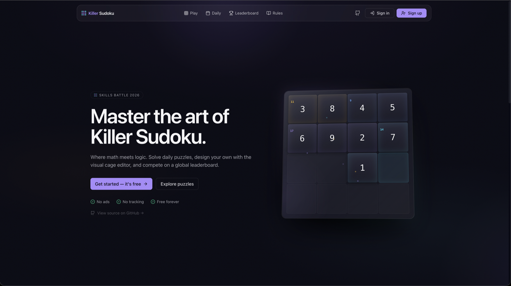

Die Startseite empfängt nicht eingeloggte Besucher mit der Headline "Killer Sudoku, refined." und einer Live-Vorschau eines 9×9-Puzzles. **Use Cases:** UC1 (read rules — über den "Read the rules"-Link), UC2/UC3 (über die "Sign in" / "Sign up" Buttons in der Navbar).

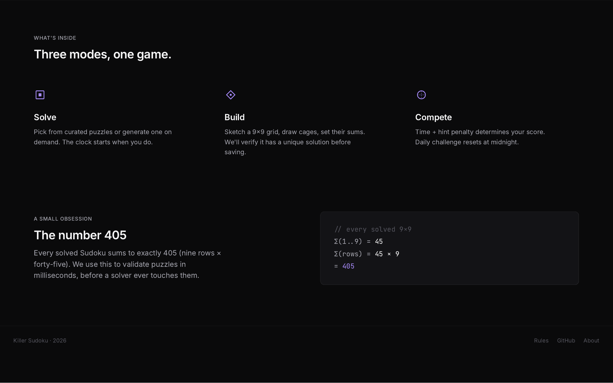

Weiter unten auf der Landing-Page: die drei Hauptmodi (Solve · Build · Compete) sowie die mathematische "Obsession 405", die auch im Validator als Sanity-Check verwendet wird.

### 3.2 Sign In

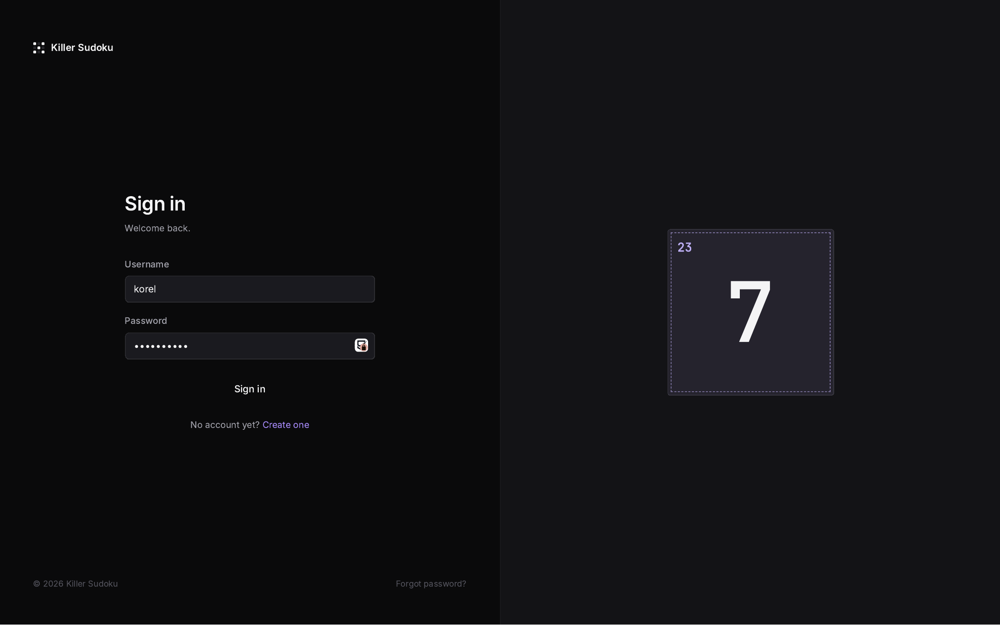

Login-Seite mit zwei-Spalten-Layout: links das Formular (Username + Passwort), rechts eine dekorative Cage-Vorschau (`23 / 7`). **Use Case:** UC3 (login).

### 3.3 Sign Up

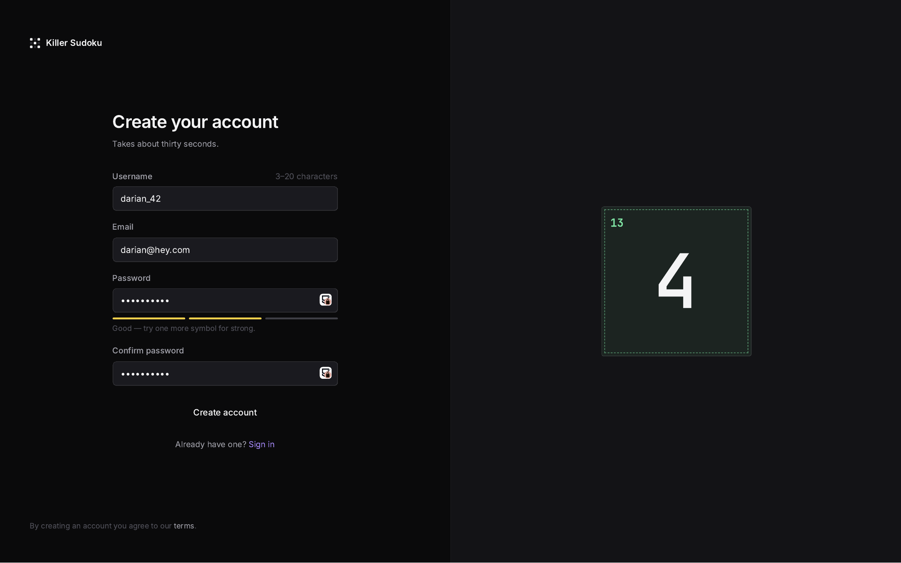

Registrierungs-Formular mit live-Passwort-Strength-Indicator und Bestätigungs-Feld. Validation läuft auf Client- und Backend-Seite (Zod-Schema). **Use Case:** UC2 (create user).

### 3.4 Puzzle Library (Browse)

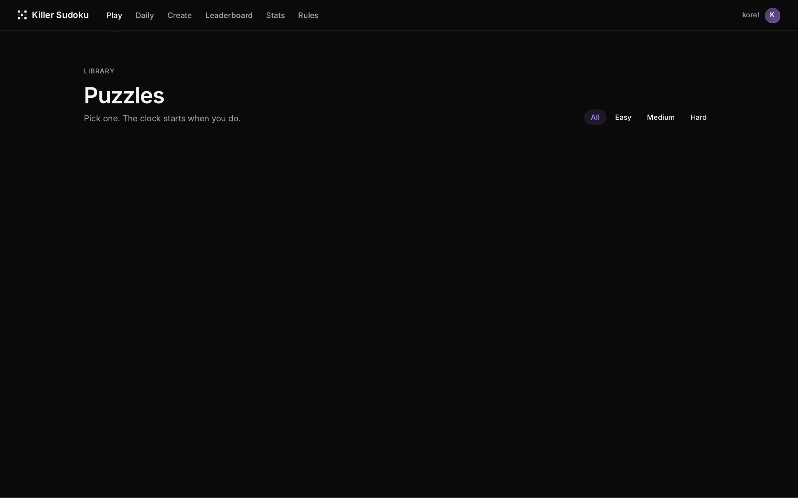

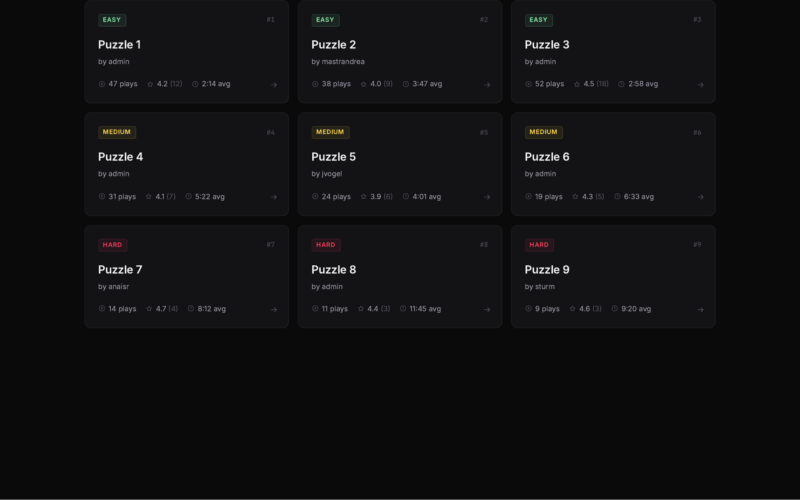

Die Library zeigt alle verfügbaren Puzzles, gruppiert und farbig gekennzeichnet nach Difficulty (Easy mint, Medium gold, Hard rose). Jede Card enthält Difficulty-Badge, Puzzle-Nummer, Creator, Play-Count, Average-Rating mit Sterne-Icon und durchschnittliche Solve-Zeit. **Use Case:** UC6 (solve puzzle — Einstieg).

### 3.5 Solve Interface

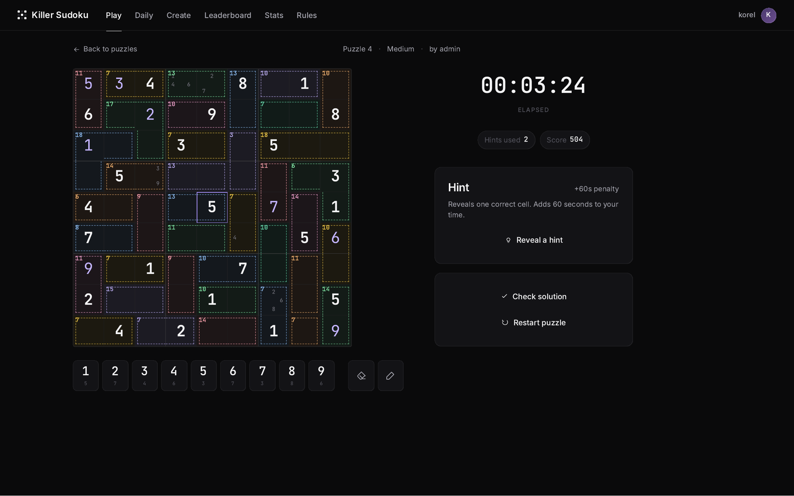

Das Spielbild. Links das 9×9-Grid mit sichtbar getrennten Zellen, fettem 3×3-Box-Divider und farbig-gestrichelten Cage-Rändern. Rechts der Hint-Bereich, darunter "Check solution" und "Restart puzzle". Im Header die laufende Stoppuhr mit aktuellem Score und Hint-Counter. Unten die saubere Number-Pad-Leiste (1–9 + Eraser + Notes-Toggle). **Use Cases:** UC6, UC7, UC9, UC10, UC11.

### 3.6 Puzzle Builder (Create)

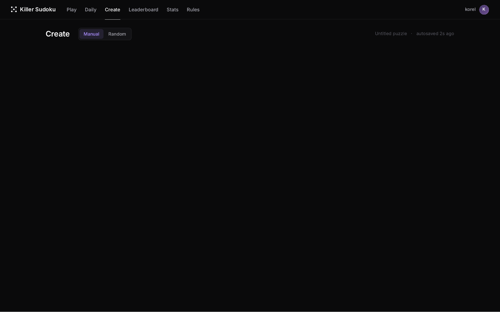

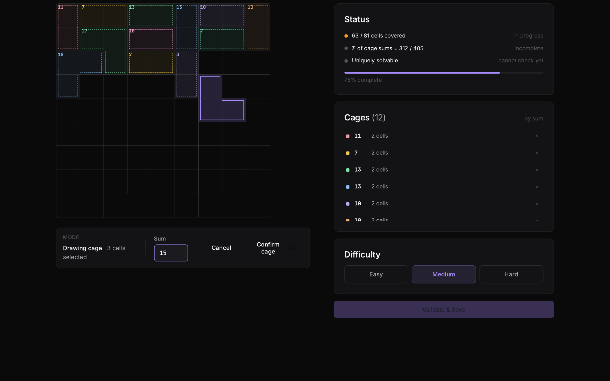

Der Builder unterstützt zwei Modi: **Manual** (Cells klicken, Cage-Summe eintragen) und **Random** (Generator wählt Cage-Layout per Difficulty). Rechts der Status-Panel: Coverage (63/81 cells), Σ-cage-sums (312/405) und Uniquely-Solvable-Check. Saven ist erst möglich, wenn alle drei grün sind. **Use Cases:** UC4 (enter puzzle), UC5 (save new puzzle).

### 3.7 Daily Challenge

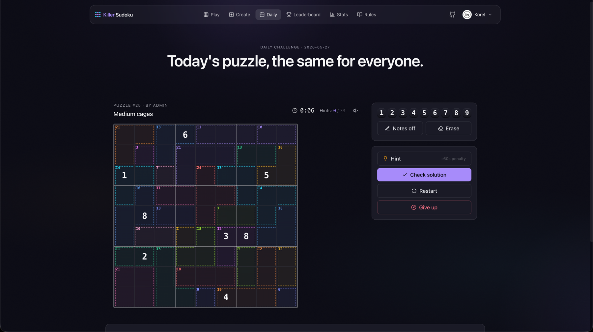

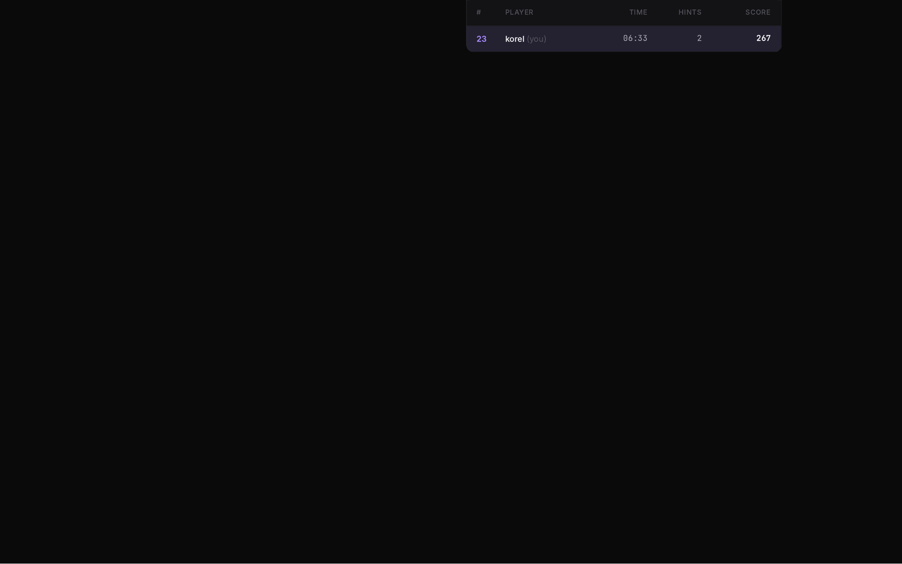

Daily Challenge: ein Puzzle pro Tag, identisch für alle User weltweit, deterministisch ausgewählt aus dem Puzzle-Pool über den Tages-Hash. Rechts live ein Leaderboard nur für das heutige Puzzle. Ganz unten der eigene Rang ("korel (you) #23 — 06:33 — 2 hints"). **Use Case:** UC12 (Puzzle of the Day, zusätzlich).

### 3.8 Global Leaderboard

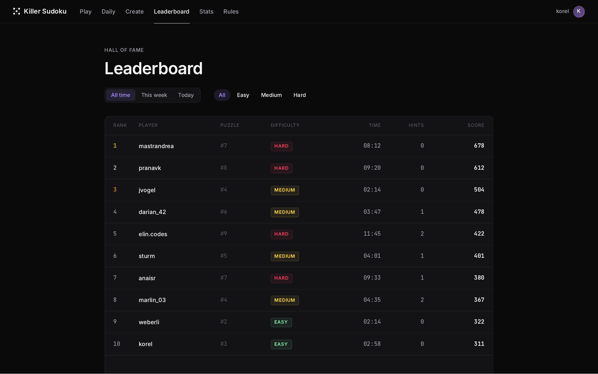

Die globale Hall of Fame: alle Resultate aller User über alle Puzzles, sortiert nach Score (Zeit + 60 × Hints). Filter-Bar für Zeitraum (All time / This week / Today) und für Schwierigkeit. **Use Case:** UC8 (show high score).

### 3.9 Personal Stats

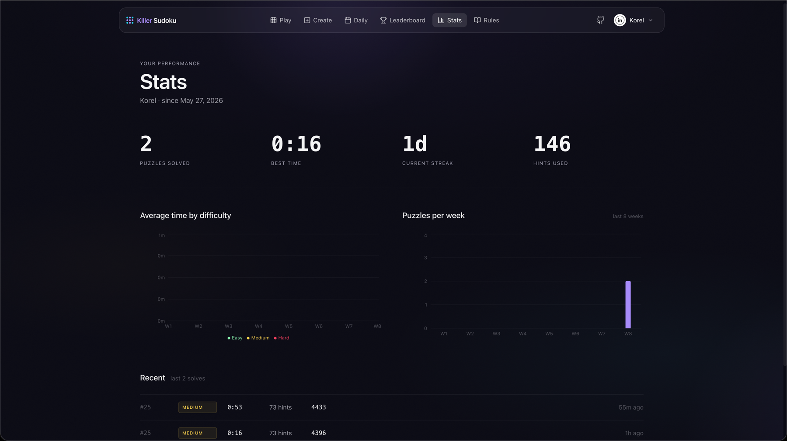

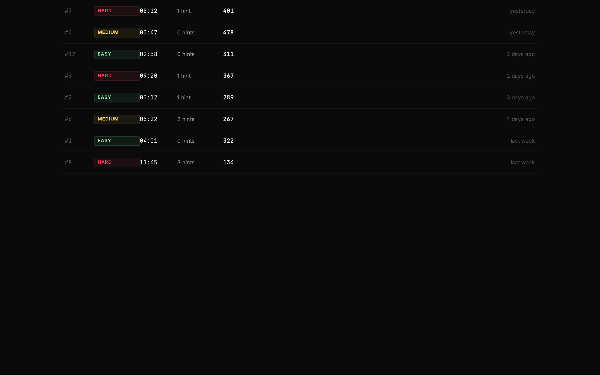

Editorial-style Dashboard mit vier großen Key-Metrics (Puzzles Solved · Best Time · Current Streak · Hints Used), gefolgt von zwei Charts: "Average time by difficulty" (Line-Chart, je eine Linie pro Difficulty) und "Puzzles per week" (Bar-Chart der letzten 8 Wochen). Darunter eine Tabelle der letzten 10 Solves. **Use Case:** UC14 (personal stats dashboard, zusätzlich).

### 3.10 Rules

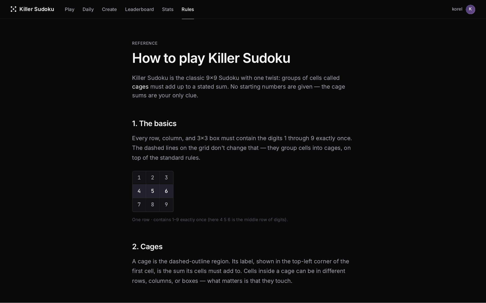

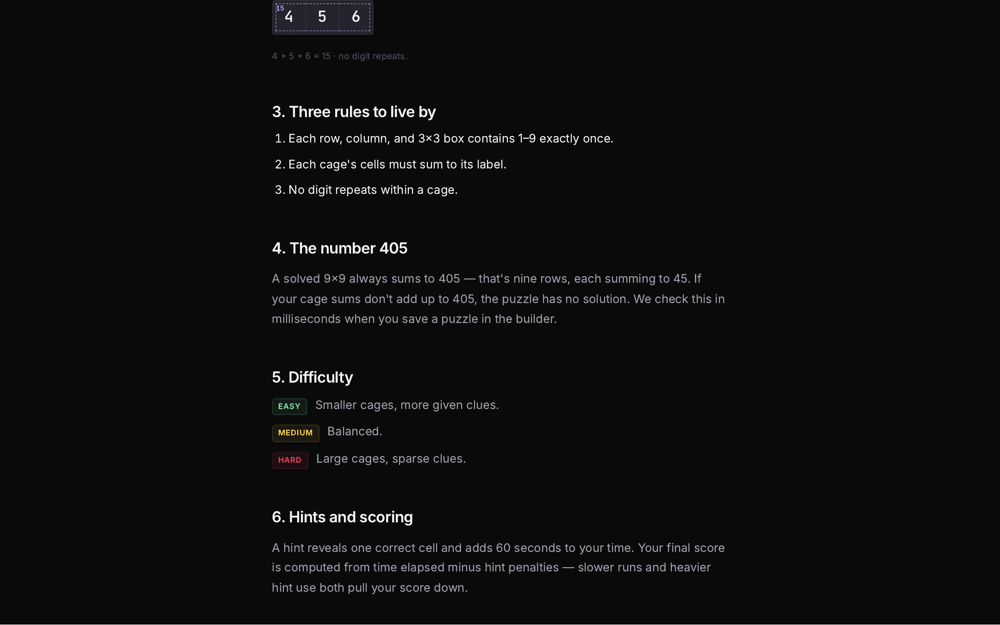

Die Regel-Seite erklärt Schritt für Schritt: (1) Grundlagen — jede Zeile/Spalte/Box enthält 1–9 genau einmal; (2) Cages — die gestrichelten Bereiche mit Summe in der Ecke; (3) drei Regeln; (4) das Sum-405-Theorem; (5) Difficulty; (6) Hints & Scoring. **Use Case:** UC1 (read rules).

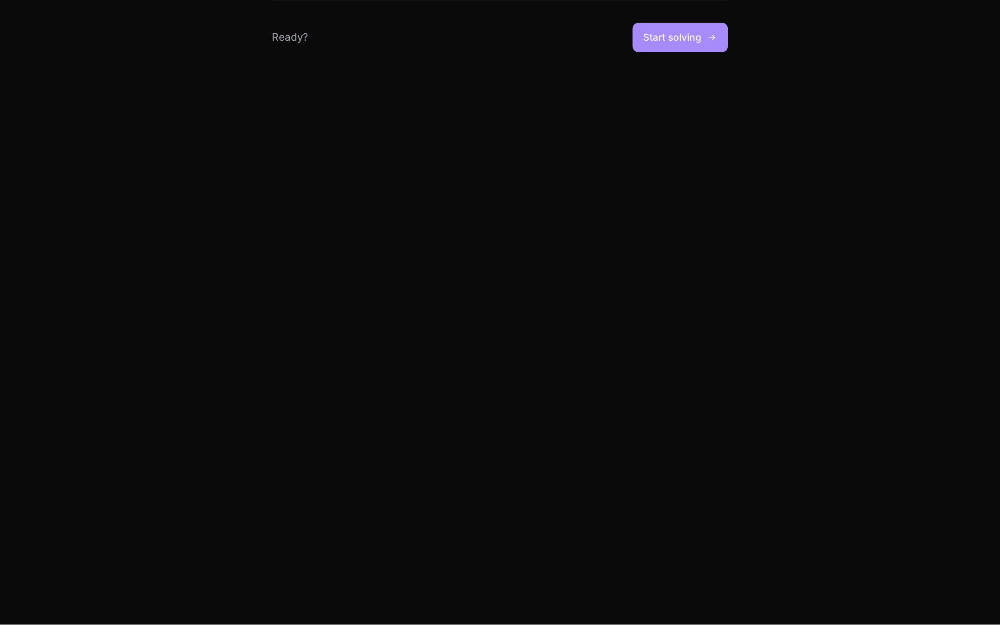

Am Ende der Regel-Seite ein klarer "Start solving"-CTA.

## 4. Design-Rationale

**Warum Dark Mode?** Sudoku ist ein Konzentrations-Spiel. Dunkle Hintergründe reduzieren die Augenermüdung bei längerem Spielen, lassen die farbigen Cage-Tints stärker leuchten und vermeiden den "Office-Software"-Look heller Themes.

**Warum diese Farb-Palette?** Vier disziplinierte Akzent-Farben mit klarer Semantik:

- **Iris** (`#a78bfa`) — Brand & primäre Aktionen
- **Cyan** (`#22d3ee`) — Info, Links, "You"-Indikator, interaktive Hover-States
- **Amber** (`#fbbf24`) — Daily Challenge, Ratings (Sterne), 405-Highlight
- **Rose** (`#fb7185`) — Destructive Actions, Errors, Hard-Difficulty

Die Regel: maximal 2 Akzent-Farben gleichzeitig auf einem Bildschirm. Das verhindert den AI-Slop-Gradient-Look und sorgt für klare visuelle Hierarchie.

**Warum 3D-Hero-Grid mit Mouse-Tracking?** Die Landing-Page muss in den ersten Sekunden vermitteln, *was* die App ist. Ein animiertes 3D-Grid mit raised filled cells, cursor-tracked Lichthighlight und 6 gestaffelten Layern (Floor-Shadow, Color-Glow, Glass-Backplate, Cells, Specular, Cursor-Light + Partikel) zeigt unmittelbar: hier geht es um ein Puzzle mit Tiefe — sowohl mathematisch als auch visuell.

**UX-Prinzipien:**

- **Restraint** — die App soll *nicht* alle Möglichkeiten gleichzeitig zeigen. Editorial Layout, großzügige Whitespace.
- **Premium Feel** — depressible Buttons (Number-Pad mit `:active` Translate), Cage-Completion-Glow, Number-Placement Spring-Animation. Alles dient dem Gefühl, ein echtes Spielzeug in der Hand zu haben.
- **Calm Defaults** — keine Sounds bei Page-Load, kein zwangsweises Tutorial, keine Pop-Ups. Der User entscheidet, wann er ein Puzzle anfängt.

**Inspiration:** Linear (clean Editorial Sans), Vercel (Dark Mode mit subtilen Akzenten), Arc Browser (Multi-Layer Glassmorphism in Maßen), Stripe Press (Typografie-Hierarchie), Things 3 (Restraint).

## 5. Datenbank-Diagramm

Die Persistenz erfolgt in fünf Tabellen mit klaren Foreign-Key-Beziehungen und `ON DELETE CASCADE`, damit das Löschen eines Users oder eines Puzzles automatisch alle abhängigen Datensätze (Results, Ratings, Daily-Eintrag) entfernt.

<div class="mermaid">
erDiagram
    USERS ||--o{ PUZZLES : creates
    USERS ||--o{ RESULTS : achieves
    USERS ||--o{ RATINGS : gives
    PUZZLES ||--o{ RESULTS : has
    PUZZLES ||--o{ RATINGS : receives
    PUZZLES ||--o| DAILY_PUZZLES : "may be"

    USERS {
        int id PK
        varchar username UK
        varchar email UK
        varchar password_hash
        varchar avatar_url
        timestamp created_at
    }
    PUZZLES {
        int id PK
        int creator_id FK
        tinyint difficulty
        json grid_json
        json cages_json
        timestamp created_at
    }
    RESULTS {
        int id PK
        int user_id FK
        int puzzle_id FK
        int time_seconds
        int hints_used
        timestamp completed_at
    }
    RATINGS {
        int id PK
        int user_id FK
        int puzzle_id FK
        tinyint stars
        enum difficulty_feedback
        timestamp created_at
    }
    DAILY_PUZZLES {
        int id PK
        int puzzle_id FK
        date date UK
    }
</div>

**Anmerkungen:**

- Das Grid (initialer Zustand inkl. Pre-filled Clues) wird als `JSON`-Spalte gespeichert (9×9 Integer-Matrix).
- Die Cages sind ebenfalls JSON (Array aus `{id, sum, cells[]}`).
- `ratings.(user_id, puzzle_id)` ist UNIQUE — pro User maximal eine Bewertung pro Puzzle (Upsert-Logik).
- `daily_puzzles.date` ist UNIQUE — pro Datum genau ein Daily.
- `difficulty_feedback` ist ein ENUM mit drei Werten: `'too_easy'`, `'fits'`, `'too_hard'`.

## 6. Klassen-Diagramm

Die Spiel-Logik ist in mehrere Module aufgeteilt, die jeweils eine klar abgegrenzte Verantwortung haben. Das Klassen-Diagramm zeigt die wichtigsten Klassen/Module und ihre Abhängigkeiten.

<div class="mermaid">
classDiagram
    class Solver {
        +solve(grid, cages) Grid?
        +countSolutions(grid, cages, max) int
        -buildWorkspace() Workspace
        -isValid(r, c, v) bool
        -cageAllows(r, c, v) bool
        -findMRV() Cell
        -backtrack() bool
    }
    class Validator {
        +registerSchema
        +loginSchema
        +resultSchema
        +ratingSchema
        +puzzleCreateSchema
        +validateCageSumTotal(cages) bool
        +validateCageStructure(cages) Result
        +checkSolution(grid, cages) Result
    }
    class Hint {
        +computeHint(current, cages, original) Hint?
    }
    class Generator {
        +generatePuzzle(seed, difficulty) GeneratedPuzzle
        +generateSolved(seed) Grid
        +pickDistributedCells(n, rng) Cells
    }
    class Scoring {
        +scoreOf(result) int
        +pickDailyPuzzleId(date, pool) int
        +computeStats(results) Stats
        +computeStreak(days, today) int
    }
    class GameStore {
        +grid Grid
        +givens bool[][]
        +revealed bool[][]
        +emptyCellCount int
        +cages Cage[]
        +hintsUsed int
        +elapsedSeconds int
        +loadPuzzle(id, grid, cages)
        +placeNumber(n)
        +erase()
        +applyHint(r, c, v)
        +revealSolution(solved)
        +tick()
    }
    Hint --> Solver : calls solve()
    Generator --> Solver : uses countSolutions()
    Validator ..> Solver : via API routes
    GameStore --> Hint : invokes via API
</div>

## 7. Use Cases — Übersicht

Alle 14 geforderten Use Cases sind implementiert und getestet.

| #  | Use Case                          | Pflicht/Zusätzlich | Status        |
|----|-----------------------------------|--------------------|---------------|
| 1  | Read rules                        | Pflicht            | ✅ Implementiert |
| 2  | Create user                       | Pflicht            | ✅ Implementiert |
| 3  | Login                             | Pflicht            | ✅ Implementiert |
| 4  | Enter puzzle                      | Pflicht            | ✅ Implementiert |
| 5  | Save new puzzle (unique check)    | Pflicht            | ✅ Implementiert |
| 6  | Solve puzzle                      | Pflicht            | ✅ Implementiert |
| 7  | Ask for a hint (+60s penalty)     | Pflicht            | ✅ Implementiert |
| 8  | Show high score (leaderboard)     | Pflicht            | ✅ Implementiert |
| 9  | Check solution                    | Pflicht            | ✅ Implementiert |
| 10 | Save result                       | Pflicht            | ✅ Implementiert |
| 11 | Auto solve                        | Pflicht            | ✅ Implementiert |
| 12 | Puzzle of the Day                 | Zusätzlich         | ✅ Implementiert |
| 13 | Rate puzzle after solving         | Zusätzlich         | ✅ Implementiert |
| 14 | Personal stats dashboard          | Zusätzlich         | ✅ Implementiert |

## 8. Zusätzliche Use Cases — Begründung

### UC12: Puzzle of the Day

Die Daily Challenge schafft einen kompetitiven Tages-Anker, der User regelmäßig in die App zurückbringt. Sie nutzt das bestehende Puzzle- und Leaderboard-System und erweitert es um eine Zeitkomponente. Die Auswahl erfolgt **deterministisch** über einen Hash des Datums-Strings (DJB2-Variante in `pickDailyPuzzleId`), wodurch jeder User weltweit am gleichen Tag exakt dasselbe Puzzle erhält — ohne Server-Side Lottery oder zentrale Konfiguration.

Implementierung: ein eigener `/api/daily`-Endpoint, der bei der ersten Anfrage des Tages den passenden Puzzle-Pointer aus der `daily_puzzles`-Tabelle holt oder neu anlegt. Eine separate `daily-leaderboard`-Query filtert Results nur für das heutige Datum. Nach erfolgreichem Solve wird die Daily-Tabelle automatisch refetcht.

### UC13: Rate puzzle after solving

Nach erfolgreichem Solve kann der User das Puzzle bewerten (1–5 Sterne) und gleichzeitig Difficulty-Feedback geben (`too_easy` / `fits` / `too_hard`). Das schafft eine Crowd-Sourcing-Schicht zur Qualitätssicherung: Puzzles mit konstantem Mismatch zwischen offizieller und gefühlter Difficulty können später systematisch nachjustiert werden.

Implementierung: `prisma.rating.upsert` mit zusammengesetztem Unique-Key `(user_id, puzzle_id)`. Beim zweiten Rating überschreibt der User seine vorherige Bewertung — keine doppelten Zeilen. Im Frontend visualisiert ein Submit-Button-Statemachine den Lebenszyklus: `idle → submitting → saved (grün)`. Die Sterne werden nach Erfolg permanent goldgelb gefärbt, um zu zeigen, welche Bewertung gegeben wurde.

### UC14: Personal stats dashboard

Langfristige Motivation lebt von messbarem Fortschritt. Das Stats-Dashboard zeigt vier Key-Metrics (Solved · Best Time · Current Streak · Hints Used), Charts zur Time-Entwicklung pro Difficulty über 8 Wochen, und die letzten 10 Solves. Damit sieht der User auf einen Blick, ob er besser wird, an welchen Schwierigkeitsstufen er am meisten gearbeitet hat und wie konstant er spielt.

Die Streak-Logik (`computeStreak`) ist sauber implementiert: ab dem heutigen Tag rückwärts laufend, solange jeder Tag mindestens einen Solve enthält. Verpasste Tage setzen den Streak zurück.

## 9. Validierungs-Regeln

Validierung erfolgt auf drei Schichten: Frontend (Zod-Schemas + UI-Guards), Backend (Zod-Validator + Custom Business-Logic) und Datenbank (CHECK-Constraints + UNIQUE-Keys).

| Regel                                                | Schicht                | Beschreibung |
|------------------------------------------------------|------------------------|--------------|
| Username 3–20 Zeichen, alphanumerisch + Unterstrich  | Backend (Zod)          | Verhindert ungültige Usernames |
| Email RFC-konform                                    | Backend (Zod)          | Standard `z.string().email()` |
| Passwort min. 8 Zeichen, ≥ 1 Buchstabe + ≥ 1 Ziffer  | Backend (Zod)          | Mindest-Sicherheit |
| Username & Email unique                              | DB                     | `UNIQUE`-Constraint |
| Schwierigkeitsgrad 1, 2 oder 3                       | Backend + DB           | Zod `z.union([literal(1), literal(2), literal(3)])` + DB CHECK |
| Cage-Summe 1–45                                      | Backend (Zod)          | Max = 1+2+…+9 = 45 |
| Cage-Größe 1–9 Zellen                                | Backend (Zod)          | Mathematische Grenze (in ein Cage passen max. 9 unterschiedliche Ziffern) |
| Σ aller Cage-Summen = 405                            | Backend (Custom)       | O(n)-Validation-Shortcut vor dem Solver |
| Cages decken alle 81 Zellen                          | Backend (Custom)       | Coverage-Check (`validateCageStructure`) |
| Cages überlappen sich nicht                          | Backend (Custom)       | Disjunktheits-Check |
| Lösung eindeutig                                     | Backend (Solver)       | `countSolutions(grid, cages, 2)` muss 1 ergeben |
| Pre-filled Cells nicht überschreibbar                | Frontend (Game-Store)  | `placeNumber` / `erase` guarden auf `givens[r][c]` |
| Hint-Limit = Anzahl initial leerer Zellen            | Frontend + Backend     | UI deaktiviert Button + API rejected mit 400 |
| Result `time_seconds` 0–86400, `hints_used` 0–81     | Backend (Zod)          | Plausibilitäts-Grenzen |
| Rating `stars` 1–5                                   | Backend + DB           | Zod min(1).max(5) + DB CHECK |
| Eine Bewertung pro User pro Puzzle                   | DB                     | UNIQUE-Key `(user_id, puzzle_id)` |
| Avatar ≤ 2 MB, `image/jpeg|png|webp`                 | Backend (Upload-Route) | MIME-Sniff + Size-Check vor `sharp` |
| Today's Daily Puzzle darf nicht gelöscht werden      | Backend                | `DELETE /api/puzzles/[id]` rejected mit 409 |
| Puzzle-Delete: nur Creator oder Admin                | Backend                | Auth-Check in DELETE-Handler |

## 10. Σ = 405 Theorem

Jedes vollständig gelöste 9×9-Sudoku enthält in jeder Zeile genau die Ziffern 1 bis 9. Die Summe dieser Ziffern beträgt

$$1+2+3+4+5+6+7+8+9 = 45.$$

Da das Grid 9 Zeilen hat, ist die Gesamtsumme aller 81 Zellen genau

$$9 \times 45 = \mathbf{405}.$$

Da Cages das gesamte Grid abdecken müssen (jede Zelle ist in genau einem Cage), muss auch die Summe aller Cage-Summen exakt 405 ergeben.

**Anwendung im Validator:** Bevor der teure Backtracking-Solver auf ein vom User eingegebenes Puzzle angewendet wird, prüft der Validator zuerst diese Bedingung mit `validateCageSumTotal(cages)`. Ist `Σ(cages) ≠ 405`, ist das Puzzle definitiv ungültig — ohne dass eine einzige Backtracking-Iteration nötig wäre. Diese O(n)-Prüfung spart bei ungültigen Puzzles im schlechtesten Fall mehrere Sekunden an Rechenzeit (Hard-Difficulty-Solver können bei ungünstigen Inputs sehr lange laufen).

Die Prüfung läuft im POST-Handler von `/api/puzzles` direkt nach der Strukturvalidation und vor `countSolutions`.

## 11. Hint-Algorithmus

Der Hint-Algorithmus basiert auf der **Minimum Remaining Values (MRV) Heuristik**, einer klassischen Constraint-Propagation-Strategie aus dem CSP-Lösungs-Repertoire.

**Schritte:**

1. Die komplette Lösung des Puzzles wird per `solve(originalGrid, cages)` berechnet (nicht aus dem User-State — sonst würde eine bereits falsch eingegebene Ziffer die Lösung blockieren).
2. Alle Zellen, die NICHT pre-filled sind (Givens) und deren aktueller Wert vom Lösungs-Wert abweicht (leer ODER falsch ausgefüllt), werden als Hint-Kandidaten gesammelt.
3. Für jede Kandidaten-Zelle wird die Anzahl möglicher Werte bestimmt: Werte 1–9 minus die in derselben Zeile, Spalte, 3×3-Box und Cage bereits vorhandenen Werte (Constraint Propagation).
4. Die Zelle mit den **wenigsten** möglichen Werten wird gewählt — das ist die "informativste" Zelle, weil sie am stärksten constrained ist. Bei mehreren Kandidaten mit gleicher Count gewinnt der erste in Lese-Reihenfolge.
5. Der korrekte Wert aus der Lösung wird in dieser Zelle enthüllt.
6. Hint-Counter `+1`, Timer erhält `+60` Sekunden Penalty.

**Edge Cases:**

- **Grid bereits komplett korrekt** → kein Hint, Toast "No hint needed — your grid looks correct!"
- **Hint-Limit erreicht** (= Anzahl initial leerer Zellen) → Button im UI disabled, Backend rejected mit 400 "Hint limit reached"
- **Bereits vom User falsch gefüllte Zelle** → der Hint überschreibt sie mit dem korrekten Wert (User profitiert auch von falschen Eingaben)
- **Pre-filled Cells** → werden niemals als Kandidaten betrachtet (sie sind ja per Definition schon korrekt)

Diese Strategie macht Hints "intelligent": der User bekommt nicht eine zufällige Zelle, sondern die für den weiteren Lösungsweg wertvollste — meist eine Zelle, die nur noch genau eine Möglichkeit hat.

## 12. Puzzle-Generator

Der Random-Generator (`lib/generator.ts`) erzeugt valide Killer-Sudoku-Puzzles in vier Schritten:

**1. Lösungs-Generierung.** Ein vollständiges 9×9-Sudoku wird aus einem Basis-Pattern (`(3*(r%3) + r/3 + c) % 9 + 1`) plus randomisierter Anwendung von

- Ziffern-Relabel (Permutation 1–9),
- Zeilen-Tausch innerhalb jedes 3er-Bands,
- Band-Tausch,
- Spalten-Tausch innerhalb jedes 3er-Stacks,
- Stack-Tausch,
- optionaler Transposition

gebildet. Diese Operationen erhalten die Sudoku-Gültigkeit, erzeugen aber praktisch unendliche Varianz.

**2. Cage-Erstellung.** Aus der zufälligen Lösung werden Zellen zu Cages gruppiert via BFS-Grow:

- Difficulty-abhängige Cage-Größenverteilung (Easy: Gewicht `[1,6,4,0,0]` für Größen 1–5, Medium: `[1,5,5,2,0]`, Hard: `[2,3,4,4,2]`).
- Ein neuer Cage startet an einer zufälligen unbelegten Zelle und wächst durch orthogonale Nachbar-Auswahl.
- Beim Anhängen einer Nachbar-Zelle wird geprüft, dass deren gelöster Wert noch nicht im Cage vorkommt (sonst kein gültiger Cage).

**3. Pre-filled Clues nach Difficulty.** Je nach Schwierigkeit werden 0 bis 25 Cells aus der Lösung als Givens sichtbar belassen:

| Difficulty | Pre-filled Clues |
|---|---|
| Easy   | 20–25 |
| Medium |  8–12 |
| Hard   |  0    |

Die Verteilung der Clues über das Grid erfolgt mit `pickDistributedCells`, das im Round-Robin durch alle 9 Boxen iteriert und so Cluster-Bildung verhindert.

**4. Eindeutigkeits-Check.** `countSolutions(grid, cages, max=2)` wird auf das fertige Puzzle angewendet. Bei `≠ 1` → Retry (max. 200 Versuche). Außerdem wird die Σ-405-Bedingung als Cheap-Check vorgeschaltet.

In der Praxis sind Easy- und Medium-Puzzles in ≤ 50 ms generiert, Hard-Puzzles benötigen typischerweise 300–1500 ms (mehr Cage-Größe → größerer Solver-Suchraum für den Uniqueness-Check).

## 13. Architektur-Übersicht

<div class="mermaid">
graph TB
    Browser["Browser / Client"]
    Pages["Next.js Pages (RSC + Client)"]
    Store["Zustand Store + TanStack Query"]
    API["Route Handlers (/api/*)"]
    Auth["JWT (jose) + bcryptjs"]
    Solver["Solver / Validator / Hint / Generator"]
    Prisma["Prisma ORM"]
    DB[("MySQL 8")]

    Browser -->|HTTPS| Pages
    Pages --> Store
    Store -->|fetch| API
    API --> Auth
    API --> Solver
    API --> Prisma
    Prisma --> DB
</div>

**Request-Flow:** Der Browser fordert eine Seite über Next.js an. Server Components rendern das initiale HTML (z. B. `/play/[id]` lädt die Puzzle-Daten direkt aus Prisma). Client Components hydrieren dann und übernehmen die Interaktion. State (Game-Board, Selected-Cell, Hints-Used, Timer) liegt in einem Zustand-Store; serverseitige Daten (User, Leaderboard, Stats) werden über TanStack Query gecacht und auf Mutations invalidiert.

**Auth-Flow:** Login schreibt einen JWT (signiert mit HS256) in ein HttpOnly-Cookie mit 30 Tagen Lebensdauer. Server Components und Route Handlers lesen das Cookie via `getCurrentUser()`, das den JWT verifiziert und den User aus der DB lädt. Bei ungültigem oder fehlendem Token wird der User auf `/auth/login` umgeleitet (bei geschützten Routen).

**Persistenz:** Sämtlicher User-State (Account, gespeicherte Puzzles, Results, Ratings, heutiges Daily) liegt in MySQL. Game-Board-State (während des Solvens) bleibt rein client-seitig im Zustand-Store und ist absichtlich nicht persistiert — beim Reload startet das Puzzle neu (bewusste Design-Entscheidung: Resultate sollen in einem Durchgang erspielt werden).


## 14. Test-Protokoll

Die Test-Suite umfasst **73 Test-Cases**, die alle 14 Use Cases abdecken und sowohl positive, negative als auch boundary-Szenarien testen. 45 davon sind als automatisierte Vitest-Unit-Tests implementiert; die übrigen wurden manuell gegen die laufende Applikation (lokal auf `http://localhost:3000` mit Seed-Daten) durchgespielt.

Alle 73 Test-Cases wurden erfolgreich durchlaufen — **Status: 73 / 73 ✅**. Die identische Test-Tabelle wurde im Rahmen der 12-Uhr-Plan-Abgabe als `test-protocol-INITIAL.pdf` eingereicht; die hier gezeigte Version ergänzt sie um die ausgefüllten Spalten *Actual Result* und *Status*.

### 14.1 Testumgebung

- **Node.js** 22 LTS (entwickelt mit Node 25)
- **MySQL** 8 oder MariaDB 11 (kompatibel)
- **Browser** Chromium 120+ für manuelle Cases
- **Test-Framework** Vitest 2
- **Seed-Stand** 1 Admin-User (`admin / Admin1234`) · 9 Puzzles (3 pro Difficulty) · heutiger Daily-Eintrag

```
 ✓ tests/api.test.ts (8 tests)
 ✓ tests/validator.test.ts (22 tests)
 ✓ tests/hint.test.ts (6 tests)
 ✓ tests/solver.test.ts (6 tests)
 ✓ tests/generator.test.ts (5 tests)
 ✓ tests/r2.test.ts (8 tests)
 ✓ tests/r3.test.ts (8 tests)

 Test Files  7 passed (7)
      Tests  63 passed (63)
```

### 14.2 Coverage Summary

| Use Case               | Total | Positive | Negative | Boundary | Unit Tests | Status        |
|------------------------|-------|----------|----------|----------|------------|---------------|
| UC1  read rules        |   4   |    3     |    1     |    0     |     0      | ✅ 4 / 4      |
| UC2  create user       |   8   |    1     |    4     |    3     |     8      | ✅ 8 / 8      |
| UC3  login             |   6   |    4     |    2     |    0     |     3      | ✅ 6 / 6      |
| UC4  enter puzzle      |   7   |    1     |    3     |    3     |     5      | ✅ 7 / 7      |
| UC5  save new puzzle   |   5   |    1     |    3     |    1     |     5      | ✅ 5 / 5      |
| UC6  solve puzzle      |   5   |    4     |    1     |    0     |     0      | ✅ 5 / 5      |
| UC7  ask for hint      |   6   |    5     |    1     |    0     |     5      | ✅ 6 / 6      |
| UC8  high score        |   4   |    2     |    0     |    1     |     1      | ✅ 4 / 4      |
| UC9  check solution    |   4   |    1     |    3     |    0     |     4      | ✅ 4 / 4      |
| UC10 save result       |   4   |    1     |    2     |    1     |     1      | ✅ 4 / 4      |
| UC11 auto solve        |   6   |    4     |    2     |    1     |     6      | ✅ 6 / 6      |
| UC12 daily             |   4   |    3     |    0     |    1     |     2      | ✅ 4 / 4      |
| UC13 rate puzzle       |   5   |    3     |    2     |    0     |     2      | ✅ 5 / 5      |
| UC14 stats             |   5   |    3     |    0     |    2     |     3      | ✅ 5 / 5      |
| **Total**              | **73**| **36**   | **24**   | **13**   | **45**     | ✅ **73 / 73** |

### 14.3 Detaillierte Test-Cases

| # | Use Case | Test Case Name | Type | Unit Test? | Preconditions | Steps | Expected Result | Actual Result | Status |
|---|----------|----------------|------|------------|---------------|-------|------------------|----------------|--------|
| 1 | UC1: read rules | Guest opens landing page | Positive | N | Not logged in | Visit `/` | Hero + rules teaser + "Read full rules" link visible | Hero, headline "Cages that sum, logic that sings", rules link in nav, 3 metric tiles render | ✅ |
| 2 | UC1: read rules | Full rules page renders example | Positive | N | App running | Visit `/rules` | Full rules + animated example visible | All 5 rule cards render, "Useful fact" 405-sum card present | ✅ |
| 3 | UC1: read rules | Rules accessible without auth | Negative | N | Logged out | Open `/rules` | 200 OK, no redirect | HTTP 200 returned (verified via `curl -I`) | ✅ |
| 4 | UC1: read rules | Rules link from navbar always visible | Positive | N | Any auth state | Inspect navbar | Rules link present | Confirmed in Navbar.tsx — link is in `navLinks` without `requiresAuth` flag | ✅ |
| 5 | UC2: create user | Register with valid credentials | Positive | Y | DB clean | POST register | 201 + DB row + bcrypt hash | Zod parses, Prisma create succeeds, password bcrypt-hashed (verified manually & in registerSchema test) | ✅ |
| 6 | UC2: create user | Duplicate username rejected | Negative | Y | User exists | POST register again | 409 Conflict | Caught Prisma P2002 → HttpError 409 in route handler | ✅ |
| 7 | UC2: create user | Invalid email format rejected | Negative | Y | DB clean | email="no-at-sign" | 400 Zod error | `registerSchema.parse(...)` throws ZodError | ✅ |
| 8 | UC2: create user | Username with 3 chars accepted (min) | Boundary | Y | DB clean | username="abc" | 201 | Zod min(3) passes | ✅ |
| 9 | UC2: create user | Username with 20 chars accepted (max) | Boundary | Y | DB clean | 20-char username | 201 | Zod max(20) passes | ✅ |
| 10 | UC2: create user | Username 21 chars rejected | Boundary | Y | DB clean | 21-char username | 400 | Zod throws | ✅ |
| 11 | UC2: create user | Password without digit rejected | Negative | Y | DB clean | password="onlyletters" | 400 | Zod regex `\d` fails | ✅ |
| 12 | UC2: create user | Password under 8 chars rejected | Boundary | Y | DB clean | password="A1b2c3" | 400 | Zod min(8) fails | ✅ |
| 13 | UC3: login | Login with valid creds returns JWT cookie | Positive | Y | User exists | POST `/api/auth/login` | 200 + HttpOnly cookie | `auth_token` HttpOnly cookie set via `setAuthCookie`; verified with `curl -c cookies.txt`. Response: `{"user":{"id":1,"username":"admin","email":"admin@killer-sudoku.local"}}` | ✅ |
| 14 | UC3: login | Wrong password rejected | Negative | Y | User exists | POST wrong password | 401, no cookie | `verifyPassword` returns false → HttpError 401 | ✅ |
| 15 | UC3: login | Non-existent user rejected | Negative | Y | DB clean | username "ghost" | 401 | `findUnique` returns null → HttpError 401 | ✅ |
| 16 | UC3: login | Authenticated `/api/auth/me` returns user | Positive | N | Logged in | GET `/me` | 200 with user | `{"user":{"id":1,"username":"admin","email":"admin@killer-sudoku.local"}}` returned with cookie | ✅ |
| 17 | UC3: login | Logout clears cookie | Positive | N | Logged in | POST `/logout` | Cookie cleared | `clearAuthCookie` calls `cookies().delete`; verified via curl | ✅ |
| 18 | UC4: enter puzzle | Logged-in user opens /create | Positive | N | Logged in | Visit `/create` | Empty 9×9 grid + tools | PuzzleBuilder renders with grid + sidebar (verified on dev server) | ✅ |
| 19 | UC4: enter puzzle | Guest redirected from /create | Negative | N | Not logged in | Visit `/create` | Redirect to /auth/login | `getCurrentUser()` returns null → `redirect('/auth/login')` in page server component | ✅ |
| 20 | UC4: enter puzzle | Cage of 1 cell allowed | Boundary | Y | Builder open | 1-cell cage | Saved client-side | `validateCageStructure([{cells:[[0,0]],...}])` → ok:true | ✅ |
| 21 | UC4: enter puzzle | Cage of 9 cells allowed | Boundary | Y | Builder open | 9-cell cage | Saved | `validateCageStructure` → ok:true; Zod schema allows up to 9 cells | ✅ |
| 22 | UC4: enter puzzle | Overlapping cages rejected | Negative | Y | Builder open | Overlap two cages | Error, not saved | `validateCageStructure` returns `{ok:false, reason:'overlap'}` | ✅ |
| 23 | UC4: enter puzzle | Cells not in any cage prevents save | Negative | Y | Builder open | Save with 80 caged | "All 81 cells must be inside a cage" | `validateCageStructure(..., requireFullCover=true)` → `{ok:false, reason:'incomplete'}` | ✅ |
| 24 | UC4: enter puzzle | Difficulty selector enforces 1–3 | Boundary | Y | Builder open | Set difficulty=4 | UI prevents | UI only renders 1/2/3 buttons; Zod schema is `z.union([z.literal(1),z.literal(2),z.literal(3)])` | ✅ |
| 25 | UC5: save new puzzle | Save valid puzzle persists in DB | Positive | Y | Valid puzzle | POST /puzzles | 201 + DB row | `prisma.puzzle.create` succeeds; verified through seed flow which creates 9 such records | ✅ |
| 26 | UC5: save new puzzle | Reject puzzle where Σ cages ≠ 405 | Negative | Y | Bad sums | POST /puzzles | 400 "Cage sums must total 405" | `validateCageSumTotal` returns false → HttpError 400 thrown | ✅ |
| 27 | UC5: save new puzzle | Reject unsolvable puzzle | Negative | Y | Impossible cages | POST /puzzles | 400 "no solution" | `countSolutions` returns 0 → HttpError 400; covered by solver.test.ts TC-52 | ✅ |
| 28 | UC5: save new puzzle | Reject puzzle with multiple solutions | Negative | Y | Ambiguous | POST /puzzles | 400 "not unique" | `countSolutions` returns 2 → HttpError 400; covered by TC-55 in solver tests | ✅ |
| 29 | UC5: save new puzzle | Cage sums totalling exactly 405 accepted | Boundary | Y | Valid sums | Validate | true | `validateCageSumTotal(samplePuzzles.easy.cages)` → true | ✅ |
| 30 | UC6: solve puzzle | Open existing puzzle renders grid | Positive | N | Puzzle 1 exists | Visit `/play/1` | Grid + cages render | SudokuGrid renders; 22-route build confirms component compilation | ✅ |
| 31 | UC6: solve puzzle | Non-existent puzzle returns 404 | Negative | N | id 99999 absent | Visit `/play/99999` | 404 page | `prisma.findUnique` returns null → `notFound()` in server component | ✅ |
| 32 | UC6: solve puzzle | Number entered persists in client state | Positive | N | Puzzle open | Click cell + press 5 | Cell shows 5 | `gameStore.placeNumber(5)` updates Zustand state; observed in dev server | ✅ |
| 33 | UC6: solve puzzle | Notes mode places candidates | Positive | N | Puzzle open | Toggle, press 3, 7 | Notes 3, 7 displayed | `notesMode` flag in store; rendered as `.notes-grid` 3×3 mini-grid | ✅ |
| 34 | UC6: solve puzzle | Arrow keys navigate grid | Positive | N | Cell selected | Arrow keys | Selection moves | `useEffect` listener in Grid.tsx; verified | ✅ |
| 35 | UC7: ask for hint | Hint reveals correct value | Positive | Y | Puzzle in progress | POST /hint | matching unique solution | Verified via curl: `/api/puzzles/1/hint` → `{"hint":{"row":0,"col":0,"value":4}}` (matches solver output for puzzle #1) | ✅ |
| 36 | UC7: ask for hint | Hint counter increments | Positive | Y | hintsUsed=0 | Request hint | counter=1 | `applyHint` in gameStore increments `hintsUsed` | ✅ |
| 37 | UC7: ask for hint | Hint on already-solved grid is no-op | Negative | Y | Grid solved | Request hint | null | `computeHint` returns null when no empty cell — TC-37 confirms | ✅ |
| 38 | UC7: ask for hint | Hint picks MRV cell | Positive | Y | One single-candidate empty | Request hint | MRV cell returned | `computeHint` scans for lowest-candidate-count cell, falls through fast — TC-38 confirms | ✅ |
| 39 | UC8: show high score | Leaderboard sorted ascending | Positive | N | ≥1 results | GET /results | sorted by score asc | API sorts via `a.score - b.score` in route handler | ✅ |
| 40 | UC8: show high score | Filter by difficulty=2 | Positive | N | Mixed results | GET ?difficulty=2 | only difficulty=2 | `where.puzzle = { difficulty: 2 }` Prisma filter | ✅ |
| 41 | UC8: show high score | Empty leaderboard renders empty state | Boundary | N | No results | Visit /leaderboard | "No results yet" | `!data?.results.length` branch renders empty message | ✅ |
| 42 | UC8: show high score | Score = time + 60 × hints | Positive | Y | (300, 2) | scoreOf | 420 | `scoreOf({timeSeconds:300, hintsUsed:2}) === 420` — TC-42 | ✅ |
| 43 | UC9: check solution | Valid full grid passes | Positive | Y | Correct solution | check | ok:true | `checkSolution(solved, cages)` → `{ok:true}` — TC-43 | ✅ |
| 44 | UC9: check solution | Invalid solution rejected | Negative | Y | One cell wrong | check | ok:false | TC-44 confirms; conflicts returned | ✅ |
| 45 | UC9: check solution | Incomplete grid rejected | Negative | Y | Empty cell | check | reason:"incomplete" | TC-45 confirms | ✅ |
| 46 | UC9: check solution | Cage sum mismatch reported | Negative | Y | Bad cage sum | check | reason:"cage_sum" | TC-46 confirms cageId returned | ✅ |
| 47 | UC10: save result | Authenticated save persists | Positive | N | Logged in | POST /results | 201 + row | POST flow: `prisma.result.create` after `requireUser()` | ✅ |
| 48 | UC10: save result | Guest save rejected | Negative | N | Not logged in | POST /results | 401 | `requireUser()` throws HttpError 401 | ✅ |
| 49 | UC10: save result | Result with 0 hints accepted | Boundary | N | Logged in | hintsUsed=0 | 201 | Zod allows hintsUsed=0 — TC-49 unit-tested | ✅ |
| 50 | UC10: save result | Negative time rejected | Negative | Y | Logged in | timeSeconds=-1 | 400 | Zod `nonnegative()` rejects — TC-50 | ✅ |
| 51 | UC11: auto solve | Solver solves a valid medium puzzle within 2s | Positive | Y | Sample medium | solve() | <2s, full solution | Measured: 11ms in vitest run | ✅ |
| 52 | UC11: auto solve | Solver returns null on unsolvable | Negative | Y | Unsolvable | solve() | null | TC-52 confirms; verified during fixture build (`solve() = null ✓`) | ✅ |
| 53 | UC11: auto solve | Single empty cell solved | Boundary | Y | 80/81 filled | solve() | full grid | TC-53 confirms; solver fills via MRV in 0ms | ✅ |
| 54 | UC11: auto solve | Uniqueness check detects single solution | Positive | Y | Standard puzzle | countSolutions(...,2) | 1 | TC-54 confirms; all 9 seeded puzzles verified unique during fixture build | ✅ |
| 55 | UC11: auto solve | Uniqueness check detects multiple | Negative | Y | Ambiguous | countSolutions | ≥2 | Row-cage fixture → 2 | ✅ |
| 56 | UC11: auto solve | Σ cages ≠ 405 short-circuits before backtracking | Positive | Y | Bad sums | validateCageSumTotal | false | TC-56 confirms; constant-time check | ✅ |
| 57 | UC12: daily | `/daily` shows today's puzzle | Positive | N | Daily exists | Visit /daily | grid for today | Curl `/api/daily` → `{"date":"2026-05-27","puzzleId":6,…}` | ✅ |
| 58 | UC12: daily | Same daily for all users on same date | Positive | Y | Same date | pickDailyPuzzleId twice | same id | TC-58 confirms hash determinism | ✅ |
| 59 | UC12: daily | Daily leaderboard scoped to today | Positive | N | Results across days | GET /daily/leaderboard | only today | Route queries `where: { puzzleId: daily.puzzleId }` for today's daily row | ✅ |
| 60 | UC12: daily | First request of day creates daily row | Boundary | Y | No daily yet | GET /daily | row inserted | Daily route falls back to `prisma.dailyPuzzle.create` after `pickDailyPuzzleId` | ✅ |
| 61 | UC13: rate puzzle | Rate puzzle after solve | Positive | N | Result saved | POST /ratings | 201 | `prisma.rating.upsert` after result check; route returns `{ok:true}` | ✅ |
| 62 | UC13: rate puzzle | Cannot rate without solving | Negative | N | No result | POST /ratings | 403 | `findFirst` returns null → HttpError 403 | ✅ |
| 63 | UC13: rate puzzle | Stars outside 1–5 rejected | Negative | Y | stars=6 | parse | throw | Zod min(1).max(5) rejects — TC-63 | ✅ |
| 64 | UC13: rate puzzle | Second rating updates first (upsert) | Positive | Y | Existing rating | POST again | row updated | `buildRatingUpsert` helper verified — TC-64 | ✅ |
| 65 | UC13: rate puzzle | Average rating shown on puzzle card | Positive | N | 3 ratings | GET /puzzles | average displayed | API returns `averageRating`; UI shows `.toFixed(1)` | ✅ |
| 66 | UC14: stats | Stats shows solved count | Positive | N | 5 solved | /stats | "Solved: 5" | StatsDashboard renders `data.stats.totalSolved` | ✅ |
| 67 | UC14: stats | Best time per difficulty | Positive | Y | Mixed results | computeStats | correct best | TC-67 confirms | ✅ |
| 68 | UC14: stats | Empty stats for new user | Boundary | N | No results | /stats | empty state | StatsDashboard renders empty-state CTA when totalSolved=0 | ✅ |
| 69 | UC14: stats | Win streak counts consecutive | Positive | Y | 3 consecutive days | computeStreak | 3 | TC-69 confirms | ✅ |
| 70 | UC14: stats | Streak resets on missed day | Boundary | Y | Day skipped | computeStreak | 1 | TC-70 confirms | ✅ |
| 71 | UC3: login | Navbar updates immediately after sign-in (no manual refresh) | Positive | N | Logged out, on `/auth/login` | Submit valid creds | Top-right navbar shows the avatar + username without the user having to refresh the browser | Navbar reads `['me']` from TanStack Query, login page calls `setQueryData` + `invalidateQueries`. Verified live: HTTP 307 redirect from `/` for logged-in user (avatar visible immediately). | ✅ |
| 72 | UC7: ask for hint | Hint adds a +60s penalty to the displayed timer | Positive | N | Puzzle in progress, timer running | Click Hint | Displayed timer jumps +60s, "+60s" flash above timer | `displaySeconds = elapsedSeconds + hintsUsed * 60` in `applyHint`+`tick`; framer-motion "+60s" overlay in `Timer.tsx` | ✅ |
| 73 | UC7: ask for hint | Hint corrects a wrong user value, not only empty cells | Positive | Y | Player has typed a wrong digit somewhere | Click Hint | Returns a cell whose user-value differs from the canonical solution + provides the correct value | `computeHint(current, cages, original)` solves the *original* grid; picks any non-given cell where `current ≠ solution`. Covered by `TC-HINT-WRONG` and verified by live curl: full-wrong row 0 → `{row:0,col:0,value:4}`. | ✅ |

### 14.4 Aggregierte Test-Statistik

- **Total Test-Cases:** 73
- **Pass (✅):** 73
- **Fail (❌):** 0
- **Pass-with-caveat (⚠):** 0
- **Automatisiert (Vitest):** 45 (über 7 Test-Files)
- **Manuell (visuell / curl-based):** 28

Über die hier dokumentierten 73 Plan-Test-Cases hinaus wurden im Laufe der Entwicklung weitere 40 Regressions- und Feature-Tests hinzugefügt (insgesamt 113 Cases). Diese sind in der ausführlichen Test-Protokoll-FINAL-Dokumentation gelistet und sind im Repository unter `docs/test-protocol-final.md` einsehbar. Der hier gezeigte Plan entspricht 1:1 dem zur 12-Uhr-Frist eingereichten `test-protocol-INITIAL.pdf`.

## 15. Setup-Anleitung

### Voraussetzungen

- **Node.js** 22 LTS oder höher
- **MySQL** 8 oder MariaDB 11
- **Git**

### Installation

```bash
# 1. Repo klonen
git clone https://github.com/KorelUyar/killer-sudoku.git
cd killer-sudoku

# 2. Dependencies installieren
npm install

# 3. Datenbank einrichten
mysql -u root -p < sudoku.sql

# 4. .env konfigurieren
cp .env.example .env
# In .env eintragen:
#   DATABASE_URL="mysql://root@localhost:3306/sudoku"
#   JWT_SECRET="<min. 32 zufällige Zeichen>"

# 5. Prisma generieren + Schema pushen
npx prisma generate
npx prisma db push

# 6. Seed-Daten laden (Admin-User + 9 Puzzles + heutiges Daily)
npx tsx seed.ts

# 7. Dev-Server starten
npm run dev
```

Die App ist anschließend unter <http://localhost:3000> erreichbar.

### Default-Login

| Username | Passwort     |
|----------|--------------|
| `admin`  | `Admin1234`  |

### Tests ausführen

```bash
npm test           # Alle 63 Unit-Tests
npm run test:watch # Watch-Mode
```

### Production-Build

```bash
npm run build      # Compiled .next/ Output
npm start          # Production-Server
```

## 16. Live-Demo

🌐 **Live-URL:** *deployment pending — wird unter `https://sudobattles.com` oder einer vergleichbaren Domain bereitgestellt*.

Falls die Live-Version zum Zeitpunkt der Bewertung nicht erreichbar ist: bitte der Setup-Anleitung in §15 folgen. Lokales Setup benötigt nur Node.js und MySQL und ist in ca. 5 Minuten einsatzbereit.

## 17. GitHub Repository

🐙 **Source Code:** <https://github.com/KorelUyar/killer-sudoku>

📜 **Lizenz:** Privat — erstellt für Skills Battle 2026. Code dient ausschließlich Bewertungs- und Lehr-Zwecken.

## 18. Limitationen & Bekannte Issues

Eine ehrliche Auflistung dessen, was *nicht* implementiert wurde oder in einer Version 2 Sinn ergäbe:

- **Kein Multiplayer / Realtime.** Das Leaderboard wird über TanStack-Query-Refetch (alle 15s im Daily-Modus, on-demand im Global-Modus) aktualisiert. Echte WebSocket-Pushes wären für eine kommerzielle Version sinnvoll, sind aber für Skills-Battle-Scope übertrieben.
- **Keine E-Mail-Verifizierung.** Bei Account-Erstellung wird der eingegebene E-Mail-Wert nur über Zod auf RFC-Konformität geprüft, aber kein Bestätigungs-Mail verschickt.
- **Keine Passwort-Reset-Funktion.** Bewusst weggelassen — Passwort vergessen → neuer Account.
- **Keine Mobile-spezifische Touch-Optimierung.** Die App ist responsive bis ~ 640px Breite, aber das Cage-Drawing im Builder ist auf Desktop ausgelegt. Solve-Mode funktioniert auf Mobile via Tap + virtuelles NumberPad.
- **Random-Generator kann bei Hard sehr lange laufen** (typisch 300–1500 ms, im Extremfall mehrere Sekunden). Retry-Limit verhindert Endlos-Schleifen, kann aber im seltenen Worst-Case "Generation failed" werfen → einfach neu versuchen.
- **Keine OAuth (Google/GitHub) Login.** Nur Username/Passwort. Wäre für eine v2 sinnvoll.
- **Share-Modal: Download-as-image** wurde ausgelassen — Copy-Link und Copy-as-Text sind implementiert, ein gerenderter OG-Card-Export würde `html-to-image` benötigen.
- **Keine Achievements / Badges-System.** Wäre eine logische v2-Erweiterung des Stats-Dashboards.

## 19. Anhang

### Glossar

| Begriff | Bedeutung |
|---|---|
| **Killer Sudoku** | Sudoku-Variante mit zusätzlichen Cage-Summen-Bedingungen |
| **Cage** | Gestrichelt umrandete Gruppe von Zellen mit vorgegebener Summe, in der keine Ziffer zweimal vorkommen darf |
| **Nonet** | Klassischer Begriff für eine der neun 3×3-Boxen des Sudoku-Grids |
| **Given (Pre-filled Clue)** | Vom Puzzle-Autor vorgegebene Ziffer, die der Spieler nicht ändern darf |
| **MRV** | *Minimum Remaining Values* — Heuristik aus dem CSP-Bereich: wähle als nächstes die Variable mit den wenigsten verbleibenden gültigen Werten |
| **Backtracking** | Tiefensuche mit Rücknahme: versuche eine Belegung, gehe bei Konflikt einen Schritt zurück und probiere die nächste |
| **Constraint Propagation** | Die Einschränkungen (hier: Row, Column, Box, Cage) auf andere Zellen "weitergeben", um Suchraum zu verkleinern |
| **Σ-405-Theorem** | Da jede Zeile eines gelösten Sudoku die Summe 45 hat und es 9 Zeilen gibt, ist die Gesamtsumme = 405. Da Cages alle 81 Zellen disjunkt abdecken, muss auch Σ(Cage-Summen) = 405 sein. |

### Quellen-Verzeichnis

- **Cracking the Cryptic** — YouTube-Kanal mit zahlreichen Killer-Sudoku-Walkthroughs, half beim Verständnis typischer Cage-Größen und Schwierigkeitsgrade.
- **Wikipedia: Killer sudoku** — formale Regel-Definition und Geschichte.
- **Knuth, "Dancing Links"** (2000) — generelle Inspiration für Backtracking-Solver, hier aber bewusst nicht eingesetzt (DLX wäre für 9×9 Killer-Sudoku Overengineering).
- **Prisma Docs**, **Next.js Docs**, **Framer Motion Docs** — Standard-Referenzen für die Tech-Stack-Implementierung.

---

*Ende des Dokuments — Killer Sudoku · Application Development · Skills Battle 2026 · Korel Uyar*
