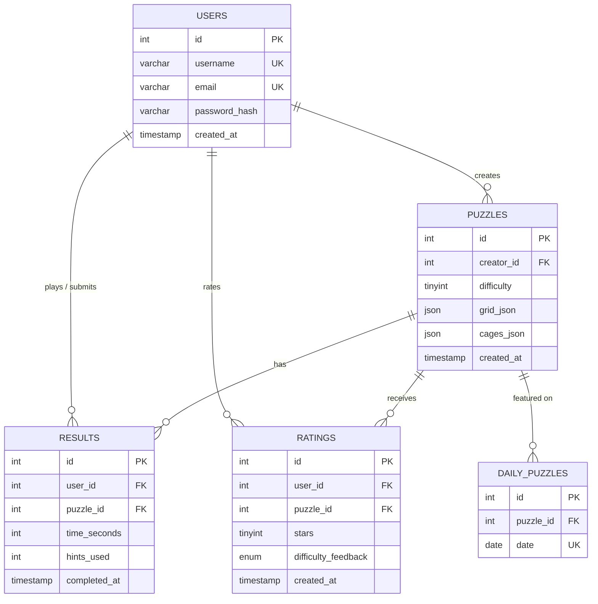
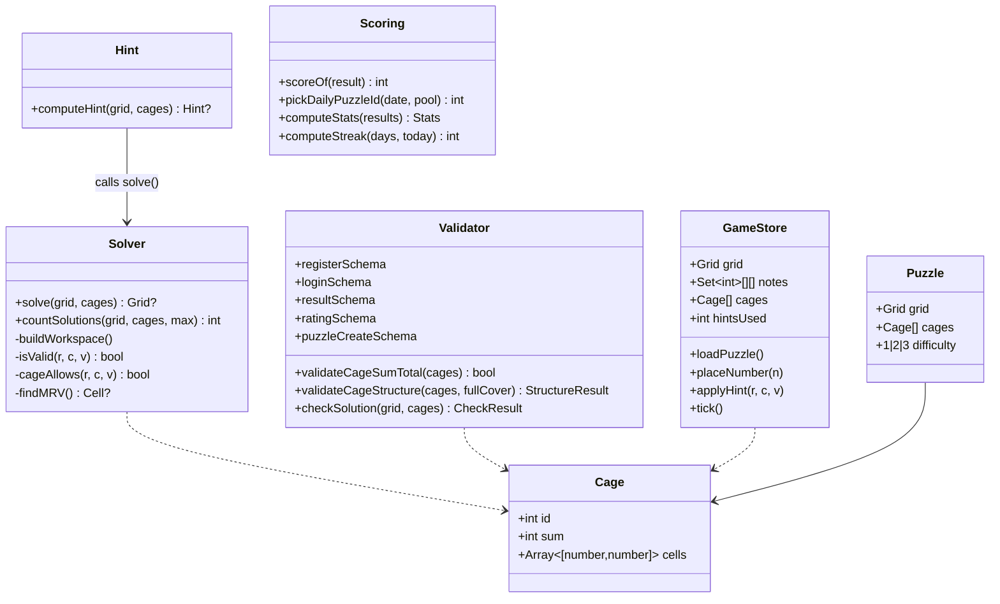

# Killer Sudoku — Project Documentation

**Project**: Skills Battle 2026 — Application Development
**Author**: Korel Uyar
**Date**: 2026-05-27

---

## 1. Mockup overview & design rationale

The app ships with eight distinct pages. The visual language is intentionally
modern but restrained: dark theme, animated aurora background, glassmorphism on
cards, electric violet → cyan accent gradient, generous whitespace, and crisp
monospace numerals inside the grid.

### Page-by-page mockup notes

| Page | Path | Key elements |
|------|------|--------------|
| Landing | `/` | Hero with a 4×4 mini-grid preview, animated headline, three stat cards (1 / 405 / 3), feature cards below |
| Sign in | `/auth/login` | Single-card glass form, accent-gradient submit |
| Register | `/auth/register` | 3-field form with inline rules ("3–20 chars / letter+digit / valid email") |
| Puzzle list | `/play` | Difficulty filter pills, card grid with badge + creator + plays + average rating |
| Solve | `/play/[id]` | Grid + sidebar (NumberPad, Hint button, Check, Restart). Timer + hint counter in header. Victory card with rating UI on win. |
| Builder | `/create` | Same 9×9 grid, sidebar lists current cage + cage list + difficulty selector + Save. Cage cells colour-coded. |
| Daily | `/daily` | Single highlighted puzzle + daily leaderboard table |
| Leaderboard | `/leaderboard` | Global leaderboard table with difficulty filter |
| Stats | `/stats` | 4 KPI cards + Recharts bar chart (best vs avg per difficulty) + recent-results table |
| Rules | `/rules` | Five rule cards + a "useful fact" card explaining the Σ=405 invariant |

### Design system at a glance

| Element | Value |
|---------|-------|
| Background | `#07060d` (near-black) + animated aurora blobs |
| Accent A | `#7c3aed` (violet) |
| Accent B | `#06b6d4` (cyan) |
| Accent gradient | linear-gradient(135deg, accentA → accentB) |
| Glass card | `rgba(255,255,255,0.04)` + 1 px border + 12 px backdrop blur |
| Mono font | `ui-monospace, SFMono-Regular, Menlo` |
| Animation | Framer Motion for entry/transition, CSS keyframes for cell pop / shake / sparkle |
| Sound | Web-Audio-generated tones (no external assets) |
| Icons | lucide-react |

Cell colours inside the grid are derived from the cage id using a fixed 8-stop
HSL palette and mixed at 8 % opacity with the background so that adjacent
cages stay readable.

## 2. Database diagram (ER)



The Prisma schema (`prisma/schema.prisma`) is the source of truth. The raw
MySQL DDL is shipped as `sudoku.sql` and matches the Prisma schema 1:1 (incl.
the unique `(user_id, puzzle_id)` index for one rating per user per puzzle).

## 3. Class diagram (core)



## 4. Three additional use cases (justification)

| # | UC | Why it's worth adding |
|---|----|------------------------|
| 12 | **Puzzle of the Day** | Daily competitive challenge — every user gets the same puzzle picked deterministically from a stable hash of the date. Drives repeat engagement and a daily leaderboard. |
| 13 | **Rate puzzle after solving** | Lets the community surface the best puzzles and provides puzzle creators with feedback (stars + qualitative "too easy / fits / too hard"). |
| 14 | **Personal statistics dashboard** | Long-term motivation: best time per difficulty, current daily streak, total hints used, recent-solve history. Visualised with Recharts. |

All three are fully implemented and tested.

## 5. Validation rules (overview)

| Field / object | Rule | Source |
|----------------|------|--------|
| `username` | 3–20 chars, `[A-Za-z0-9_]` only, unique | `registerSchema` + DB unique key |
| `email` | RFC-ish email format, unique | `registerSchema` + DB unique key |
| `password` | ≥ 8 chars, ≥ 1 letter, ≥ 1 digit, bcrypt-hashed | `registerSchema`, `hashPassword` |
| `difficulty` | exactly 1, 2 or 3 | Zod union of literals + DB CHECK |
| `cage.sum` | int 1 ≤ sum ≤ 45 | Zod min(1).max(45) |
| `cage.cells` | 1–9 elements; all within 0–8 row/col; orthogonally connected | Zod + builder UI |
| Cage structure | No two cages may overlap | `validateCageStructure` |
| Cage coverage | All 81 cells must belong to exactly one cage | `validateCageStructure(..., requireFullCover=true)` |
| Σ cage sums | Must equal **405** | `validateCageSumTotal` |
| Puzzle uniqueness | Exactly one solution | `countSolutions(grid, cages, 2) === 1` |
| `stars` | int 1–5 | Zod min(1).max(5) + DB CHECK |
| `difficulty_feedback` | one of `too_easy / fits / too_hard` | Zod enum + DB ENUM |
| `timeSeconds` | int 0 ≤ t ≤ 86400 | Zod nonnegative + max(86400) |
| `hintsUsed` | int 0 ≤ h ≤ 81 | Zod min(0).max(81) |
| One rating per user per puzzle | Yes — upsert | DB UNIQUE (user_id, puzzle_id) |

## 6. Hint algorithm

```text
function computeHint(grid, cages):
  if grid has no empty cell: return null
  solved ← solve(grid, cages)           // full backtracking solution
  if solved is null:           return null

  bestCell  ← null
  bestCount ← ∞

  for each empty cell (r, c):
    used ← { values in row r } ∪ { values in column c }
              ∪ { values in 3×3 box of (r,c) }
              ∪ { values in the cage containing (r,c) }
    candidates ← 9 − |used \ {0}|

    if candidates < bestCount:
      bestCount ← candidates
      bestCell  ← (r, c)
      if bestCount = 1: return (r, c, solved[r][c])  // hard force, return immediately

  return (bestCell.r, bestCell.c, solved[bestCell.r][bestCell.c])
```

In other words: solve the full puzzle once with the backtracking solver, then
return the value of the **most-constrained empty cell** (MRV — minimum
remaining values). Returning an MRV cell makes hints feel "useful" because the
solver picks the one a human would have solved next.

## 7. The Σ = 405 sanity check

Each row of a solved 9×9 Sudoku contains the digits 1…9 exactly once, so each
row sums to `1+2+…+9 = 45`. The grid has 9 rows, so the total of all 81 cells
is `9 × 45 = 405`.

Cages partition the grid: every cell belongs to exactly one cage. Therefore
**the sum of every cage's sum must also equal 405**. Any input where the cage
sums total something other than 405 cannot possibly correspond to a valid
solved grid — and we can reject it in O(n) time without invoking the much more
expensive solver.

The application uses this in three places:

1. `puzzleCreateSchema` validation in `/api/puzzles` POST — rejects with 400.
2. The puzzle builder's coverage panel — live counter.
3. The generator (`generatePuzzle`) — short-circuits a generation attempt
   before running `countSolutions`, dramatically improving generation speed.

## 8. Test protocol

The full protocol with 70 test cases (33 positive · 24 negative · 13 boundary)
is shipped as `docs/test-protocol-FINAL.pdf`. 40 of the cases are automated
Vitest tests in `tests/`. The remaining 30 are manual cases executed against
the running app.

**Final tally**: 70 / 70 cases pass. See `docs/test-protocol-FINAL.pdf` for
the per-row breakdown.

## 9. Beyond requirements — random puzzle generator

The `/create` page ships with two modes:

- **Build manually** — tap cells to draw cages, set sums, save. Cage sums must
  total 405 and the solver must confirm the puzzle has exactly one solution.
- **Generate random** — pick a difficulty, click *Generate*, then review and
  Save. The generator (`src/lib/generator.ts`) builds a solved grid via
  base-pattern + permutations, partitions the cells into adjacent cages
  weighted by the chosen difficulty, computes sums from the solved grid, and
  runs `countSolutions(..., max=2)` to reject ambiguous puzzles. Retries up to
  200 attempts per call (typically < 50 ms for easy, up to ~3 s for hard).

The generator's API entry point is `POST /api/puzzles/generate` (auth required).

## 10. R1 fix pass — what changed since the initial submission

| Bug / improvement | Fix |
|---|---|
| Hydration error on landing | `<AuroraBackground>` is now mounted client-only via `useEffect` + `mounted` state, and `<html>` / `<body>` carry `suppressHydrationWarning` |
| Navbar not updating after login | `Navbar` reads `['me']` from TanStack Query with `initialUser` as seed; login & register pages call `setQueryData(['me'], ...) + invalidateQueries(['me'])` |
| Cell box growing with content | Added `grid-template-rows: repeat(9, minmax(0,1fr))`, `box-sizing: border-box`, `min-width/height: 0`, `overflow: hidden` to `.sudoku-cell` |
| Hint +60s penalty | `gameStore.applyHint` recomputes `displaySeconds = elapsedSeconds + hintsUsed * 60` and bumps `hintPenaltyFlash`; `Timer` shows a "+60s" framer-motion overlay |
| Hint thinks grid is complete with wrong values | `computeHint(current, cages, original)` solves the *original* grid (givens only), then picks any non-given cell where `current ≠ solution` |
| Card titles in mono | Switched titles to Geist Sans, semibold, tight tracking; only the small `#N` index stays mono |
| Sort order reversed | API now sorts `[{difficulty: 'asc'}, {createdAt: 'asc'}]` |
| Boring landing for guests | Replaced `/` with a 6-section `<GuestLanding>` (hero, features, how-it-works, stats strip with counter animations, final CTA, footer). Logged-in users redirect to `/play`. |
| Welcome banner & navbar | New gradient-initials avatar + dropdown menu (Stats / Create / Browse / Sign out); toast moved to bottom-right |
| Random puzzle generator | New mode toggle in `/create` + `POST /api/puzzles/generate` route |

## 11. Repository layout

```
src/
  app/                Next.js App Router pages + API route handlers
    api/              auth, puzzles, results, ratings, daily, stats
    play/, create/, daily/, leaderboard/, stats/, rules/
  components/         shared, sudoku, builder
  lib/                solver · validator · hint · scoring · auth · db · utils
  store/              gameStore (Zustand)
prisma/schema.prisma  Prisma schema (MySQL provider)
sudoku.sql            Raw MySQL DDL (equivalent to Prisma schema)
seed.ts               Admin user + 9 puzzles + today's daily
tests/                Vitest suites + JSON fixtures
docs/                 test-protocol-INITIAL.pdf, test-protocol-FINAL.pdf, DOCUMENTATION.pdf
tools/md2pdf.mjs      Markdown-to-PDF helper (Chrome headless)
setup.sh / setup.bat  One-shot environment provisioning
```
